import newHero from './new-hero.mp4'
import btl from './btl.mp4'

<Hero>
   <Container>
        <Block>
            <h1>{props.pageContext.frontmatter.title}</h1>
        </Block>
        <AssetImage>
            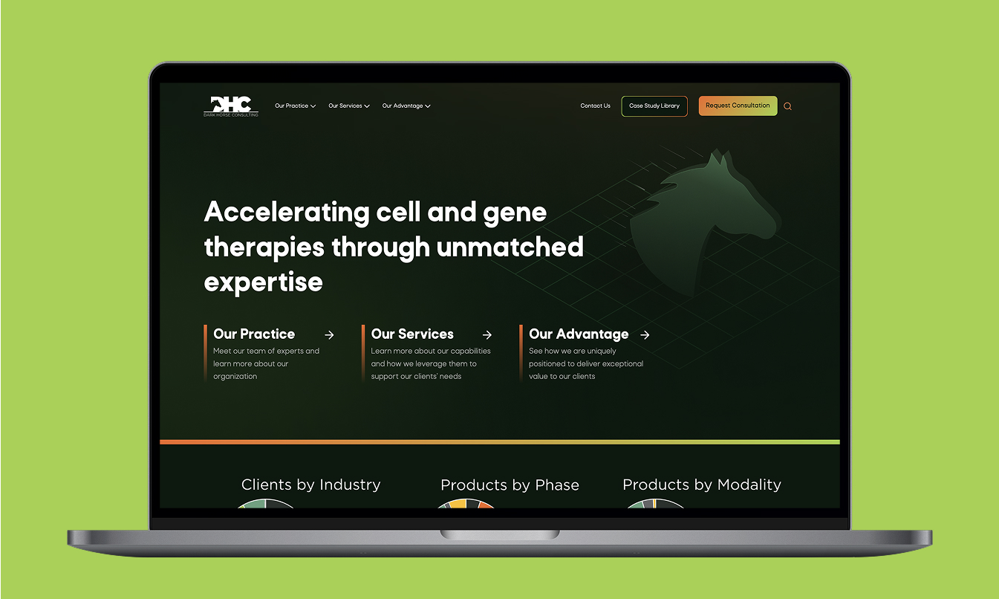
        </AssetImage>
   </Container>
</Hero>

<Container>
    <Block>
        ## Summary
    </Block>
</Container>

<Container className="work-intro">
   <MainColumn>        
        <Block>
            ### Mission

            Dark Horse Consulting has unparalleled expertise in the Cell and Gene Therapy space. The goal was to revamp their site to reflect that expertise in the market and continue to stand out ahead of the competition.
        </Block>

        <Block>
            ### My Contributions

            I worked closely with the team and project manager to go through the entire web design process in a 6-month timeframe as we needed room for a lot of executive approvals and by ins. I helped drive the design and development. They are content dense brand given what they do. I continue to work with Dark Horse and have helped launch 2 new initiatives with separate websites + continuously improving their site and SEO.
        </Block>
   </MainColumn>
   <Sidebar>
        <Block>
            ### Company

            Dark Horse Consulting Group
        </Block>
        <Block>
            ### Services

            - User Interface Design
            - User Experience Design
            - User Research & User Flows
            - Wireframing
            - Web Design
            - Web Development 
            - SEO
        </Block>
        <Block>
            ### Tools & Tech

            - Figma
            - React
            - Webflow
            - Finsweet Webflow Library  
        </Block>
   </Sidebar>
</Container>

<Container>
    <Block>
        ## Impact
        
        The primary metric for this was getting a job and a brand the client was satisfied with!

        <Metrics>
            <Metric>
                ### 6,000+
                
                More site visitors a year (this is a low volume but high dollar value industry for sales)
            </Metric>
        </Metrics>
    </Block>
</Container>

<Container>
    <Block>
        

        
        ## Site Process

    </Block>
</Container>

<Container>
    <Block>
        ### Discovery & Structure

        We kicked things off with a collaborative discovery sprint to understand DHC’s wants and needs. Most importantly what they didn’t want. I iterated on some wireframes and initial mock ups of the site. We worked quickly in some collaborative working sessions to define the overall site styleguide; the client is very much a “I’ll know it when I see it” type of client
    </Block>
    <Assets className="two-column">
        <AssetImage>
            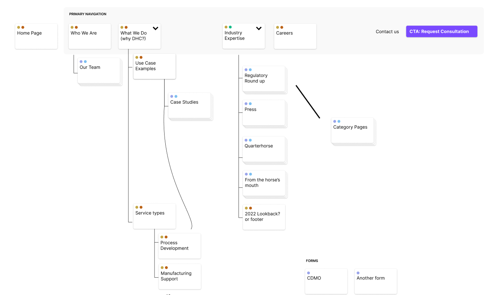
            *Sitemap*
        </AssetImage>
        <AssetImage>
            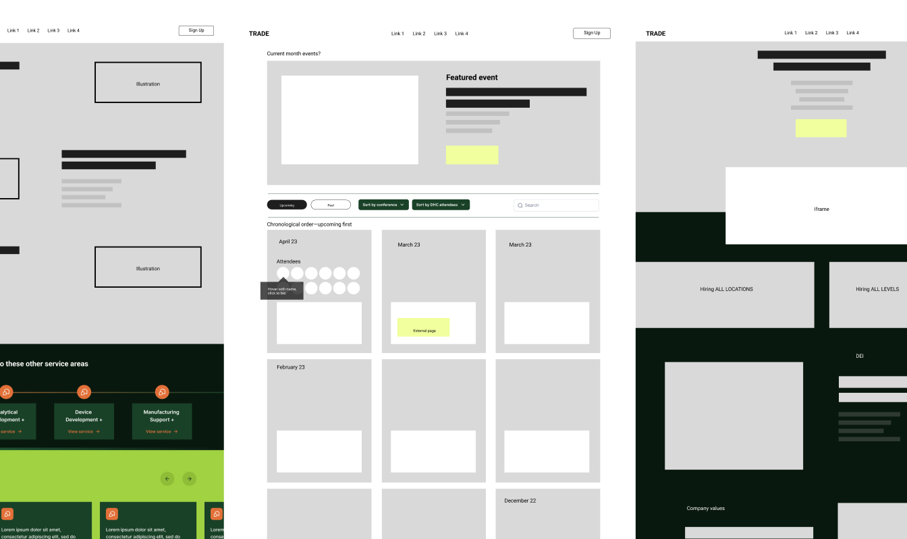
            *Wireframes*
        </AssetImage>
    </Assets>
</Container>

<Container>
    <Block>
        ### Site design

        The design needed to be simple, handle a lot of text and be very professional looking with a slight edge, embodying some of DHC’s expertise.
    </Block>
    <Assets className="two-column">
        <AssetImage>
            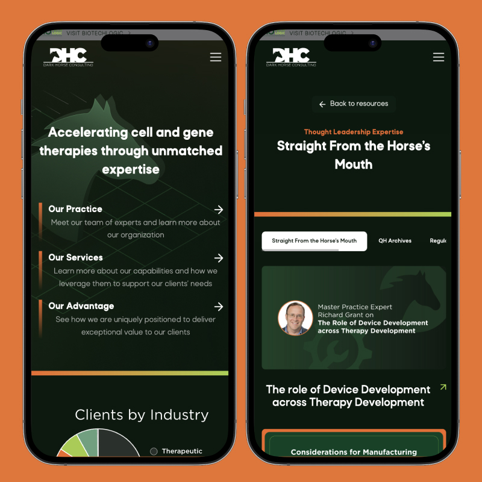
        </AssetImage>
        <AssetImage>
            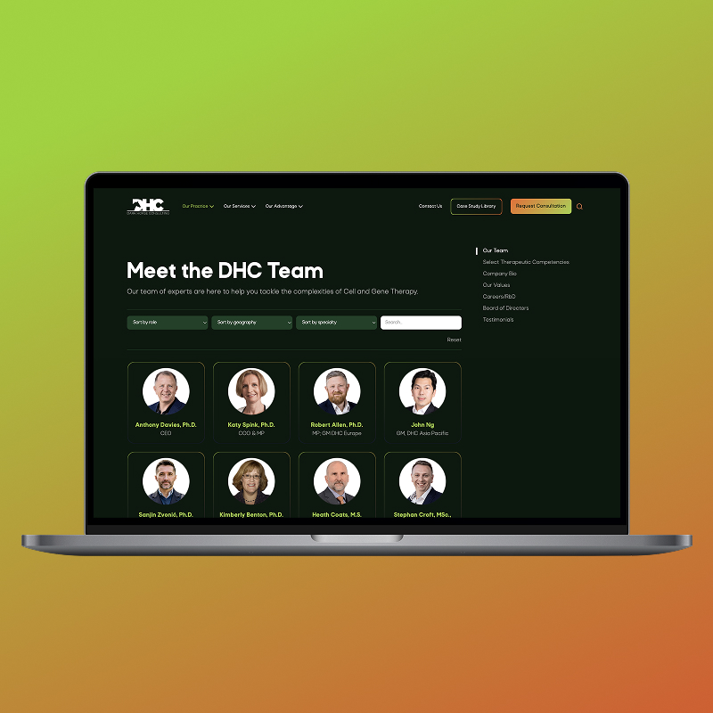
        </AssetImage>
    </Assets>
</Container>

<Container>
    <Block>
        ### Site build

        Built entirely in Webflow, the site uses flexible, client-editable content blocks and a clean CMS setup. There a few custom features with how case studies are filtered and leveraging Finsweet’s libraries of tools for combining disparate collections so we can show nested and reusable data. Their team is their product so we had to be creative on reusing them across case studies, and their capabilities.
    </Block>
    <Assets className="two-column">
        <AssetImage>
            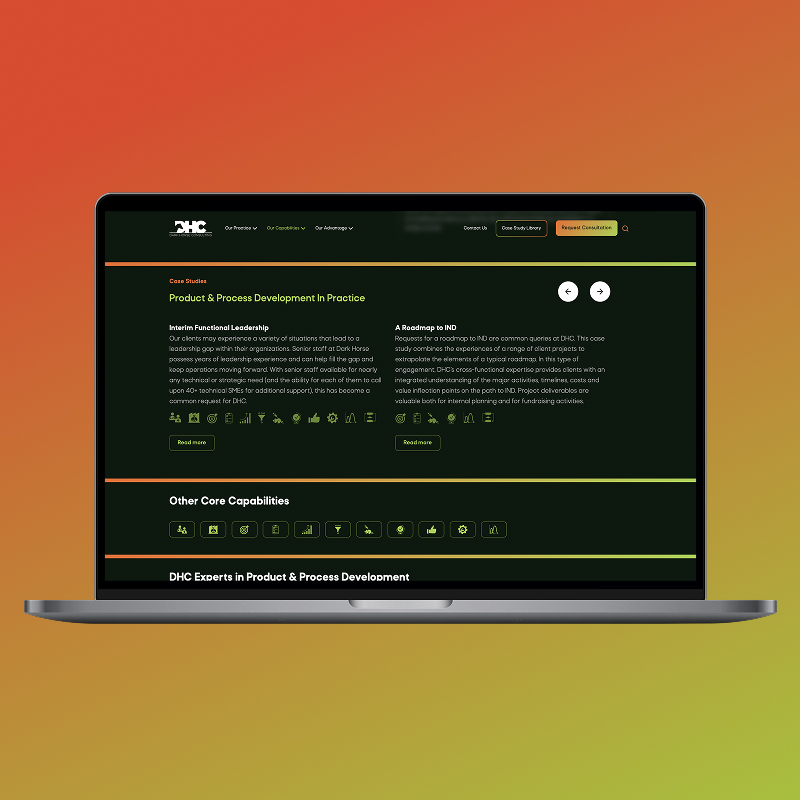
        </AssetImage>
        <AssetImage>
            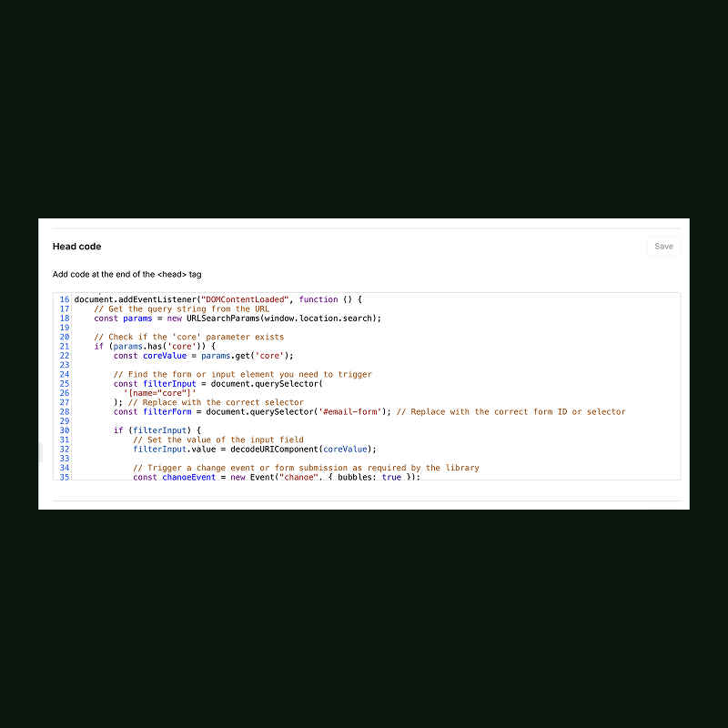
        </AssetImage>
    </Assets>
</Container>

<Container>
    <Block>
        ### On-going Support
    </Block>
    <Assets >
        <AssetVideo src={newHero}>
            *New Hero Animation*
        </AssetVideo>
    </Assets>
    <Assets className="two-column">
        <AssetImage>
            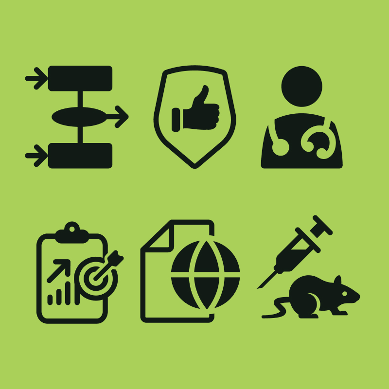
            *Update icons for service offerings*
        </AssetImage>
        <AssetImage>
            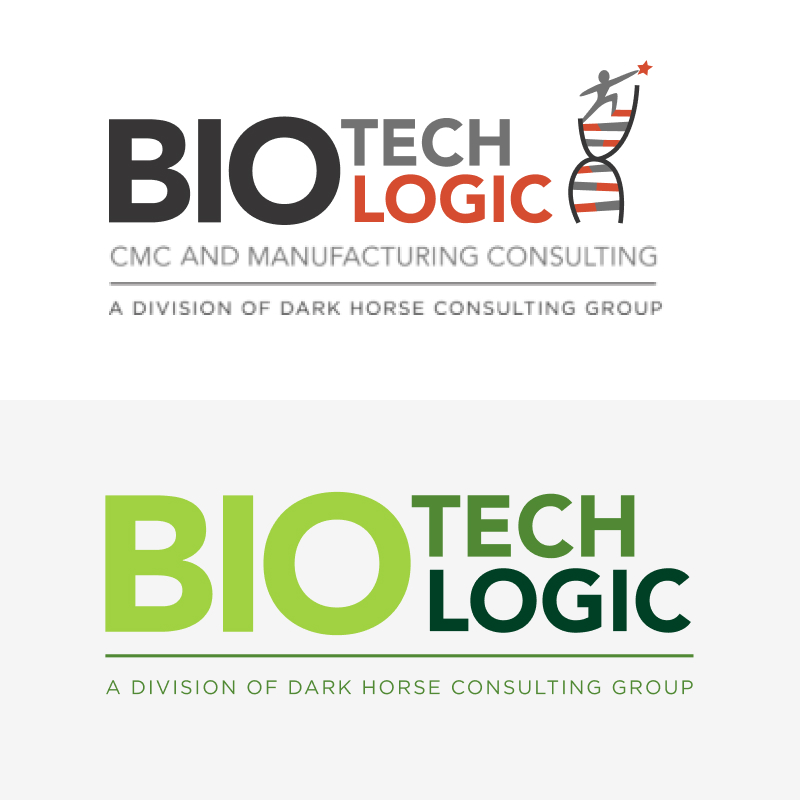
            *Acquired company logo updates (BTL)*
        </AssetImage>
    </Assets>
    <Assets >
        <AssetVideo src={btl}>
            *BTL homepage animation*
        </AssetVideo>
    </Assets>
    <Assets className="two-column">
        <AssetImage>
            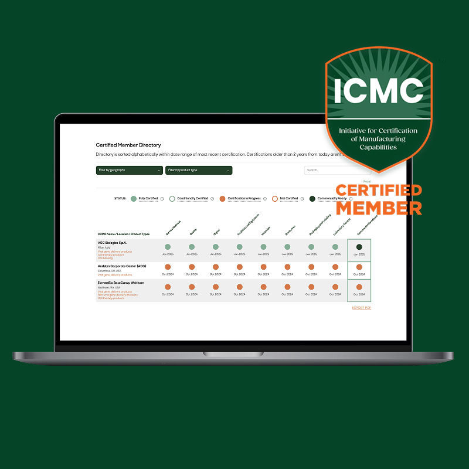
            *New initiative, ICMC Certification library*
        </AssetImage>
        <AssetImage>
            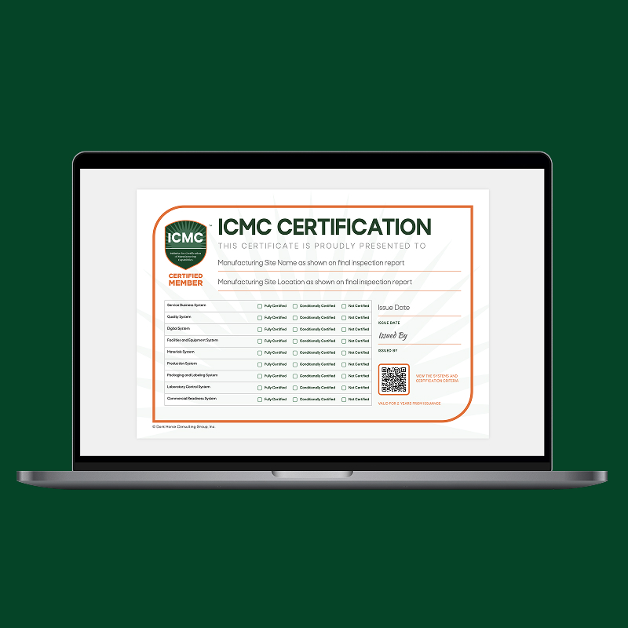
            *Custom built certificate generator with React*
        </AssetImage>
    </Assets>
    <Assets>
        
<iframe src="https://player.vimeo.com/video/625195713?badge=0&amp;autopause=0&amp;player_id=0&amp;app_id=58479&amp;autoplay=1&amp;loop=1&amp;muted=1&amp;show=card" frameborder="0" allow="autoplay; fullscreen; picture-in-picture; clipboard-write; encrypted-media" style={{position:"absolute", top:0, left:0, width: "100%", height:"100%"}} title="Dark Horse Consulting Introduction 2021 v2"></iframe>

    </Assets>
</Container>