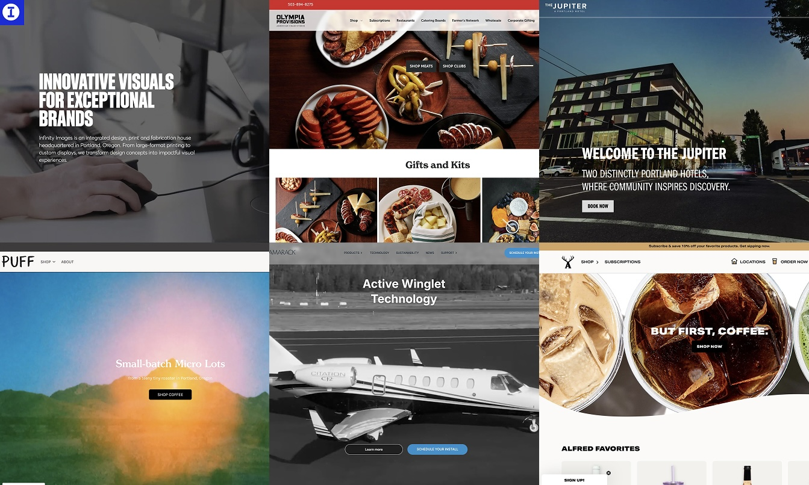
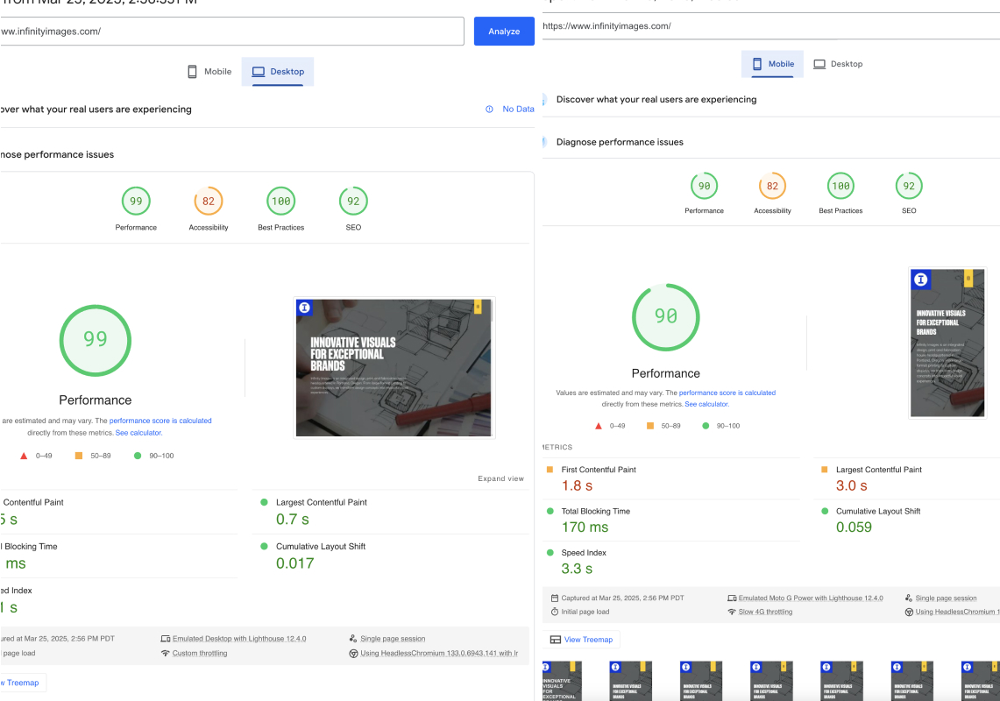
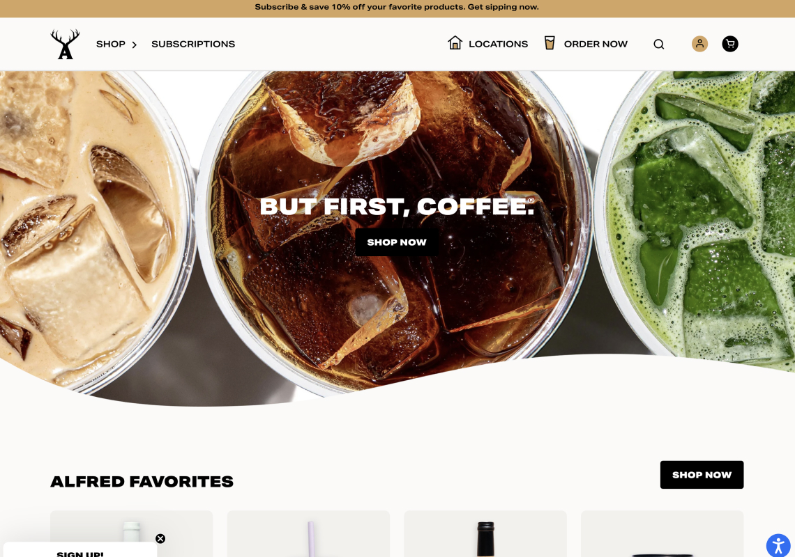
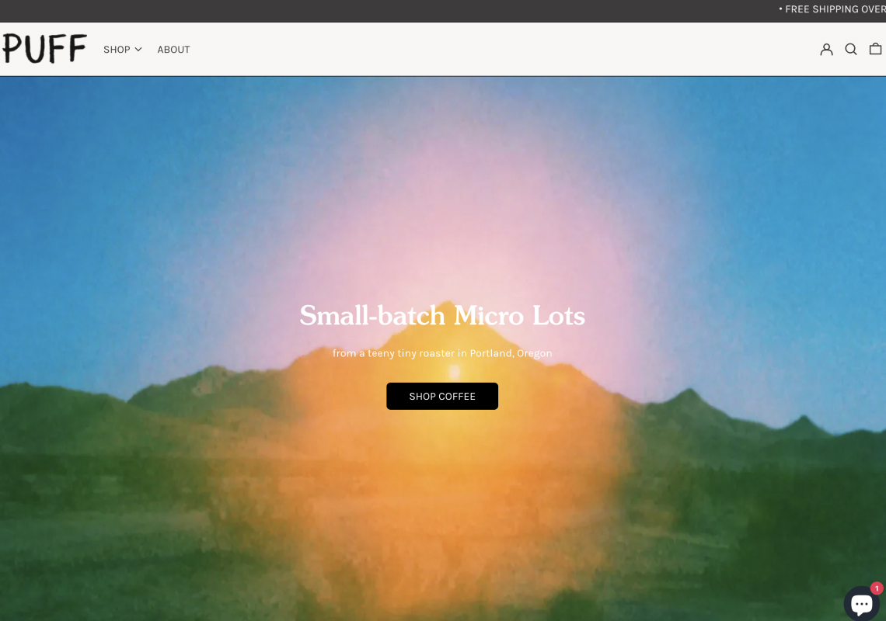
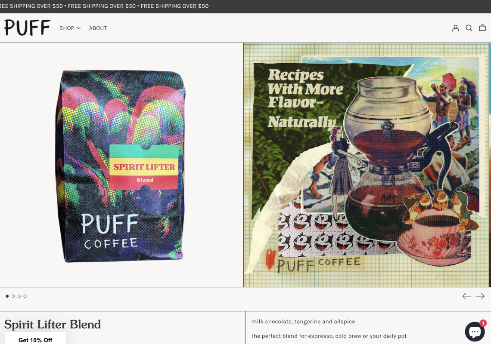
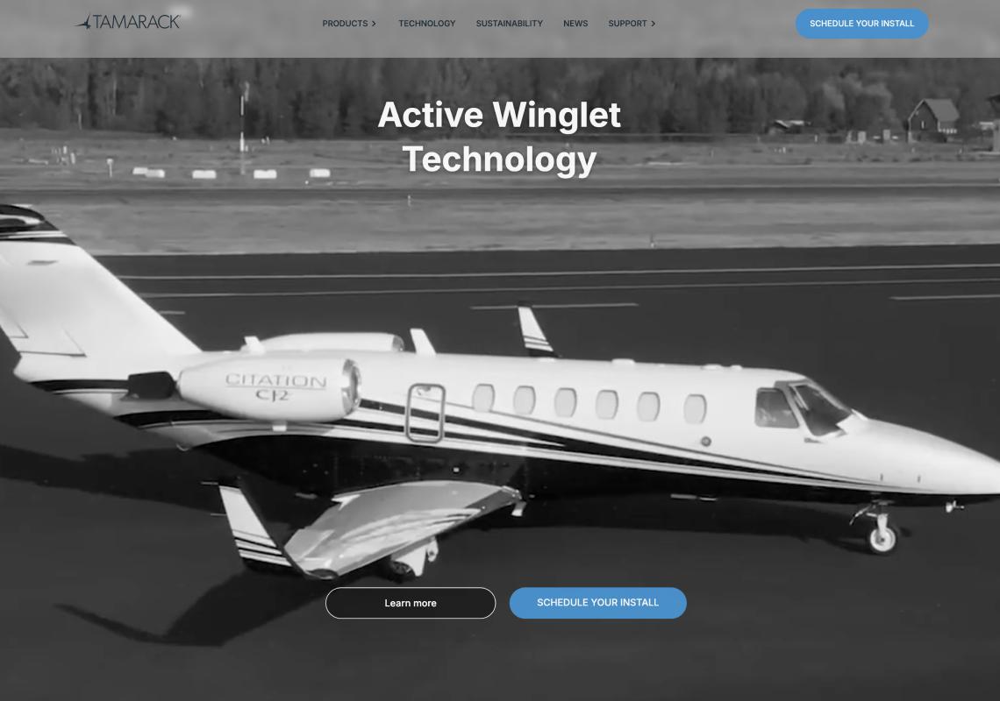
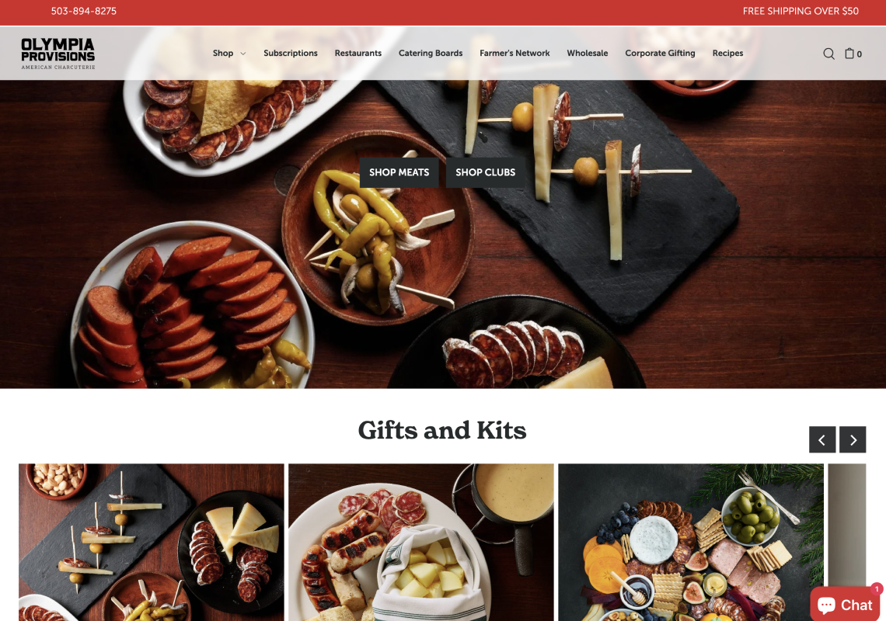
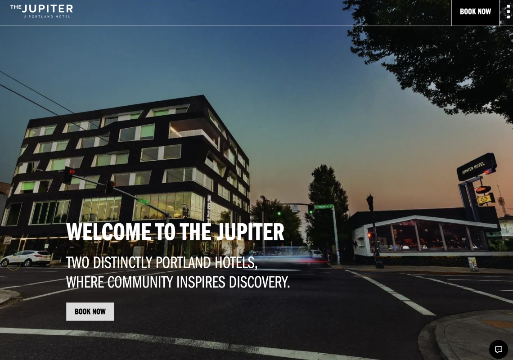
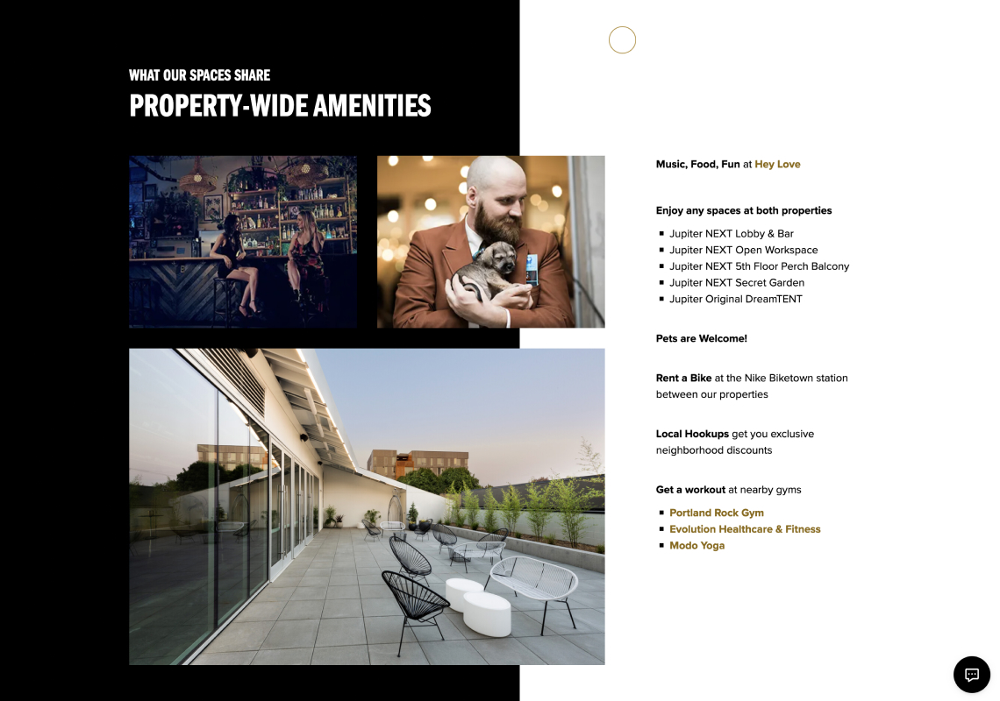

import infinityTimeline from './infinity-timeline.mp4'
import alfredCalculator from './alfred-calculator.mp4'
import tamarack from './tamarack.mp4'
import olympia from './olympia.mp4'

<Hero>
   <Container>
        <Block>
            <h1>{props.pageContext.frontmatter.title}</h1>
        </Block>
        <AssetImage>
            
        </AssetImage>
   </Container>
</Hero>

<Container>
    <Block>
        ## Summary
    </Block>
</Container>

<Container className="work-intro">
   <MainColumn>        
        <Block>
            ### Mission

            I have supported a lot of businesses and organizations to bring the ideas to life, mostly e-commerce stores and marketing sites.
        </Block>
   </MainColumn>
   <Sidebar>
        <Block>
            ### Company

            Various
        </Block>
        <Block>
            ### Services

            - Web Development 
            - Webflow Development
            - Animation
            - Javascript
            - Elixir
            - React Native
        </Block>
        <Block>
            ### Tools & Tech

            - Figma
            - Webflow
            - Shopify
            - Custom Code
            - Sanity CMS
        </Block>
   </Sidebar>
</Container>

<Container>
    <Block>
        

        
        ## Selected Contributions & Clients

    </Block>
</Container>

<Container>
    <Block>
        ### Infinity Images
    </Block>
    <Assets className="two-column">
        <AssetVideo src={infinityTimeline}>
            *25th Anniversary Timeline for Infinity Images*
        </AssetVideo>
        <AssetImage>
            
            *Fixing Site Speed Issues for Infinity Images. 52% mobile performance to 90%. Desktop performance 61% to 99%.*
        </AssetImage>
    </Assets>
</Container>

<Container>
    <Block>
        ### Alfred Coffee
    </Block>
    <Assets className="two-column">
        <AssetImage>
            
            *Alfred Coffee homepage*
        </AssetImage>
        <AssetVideo src={alfredCalculator}>
            *Custom coffee and matcha calculator to drive subscription sales*
        </AssetVideo>
    </Assets>
</Container>

<Container>
    <Block>
        ### Puff Coffee
    </Block>
    <Assets className="two-column">
        <AssetImage>
            
            *Puff Coffee homepage*
        </AssetImage>
        <AssetImage>
            
            *Puff Coffee Product Detail Page*
        </AssetImage>
    </Assets>
</Container>

<Container>
    <Block>
        ### Tamarack Aerospace
    </Block>
    <Assets className="two-column">
        <AssetVideo src={tamarack}>
            *Tamarack Technology animation*
        </AssetVideo>
        <AssetImage>
            
            *Tamarack Aerospace homepage*
        </AssetImage>
    </Assets>
</Container>

<Container>
    <Block>
        ### Olympia Provisions
    </Block>
    <Assets className="two-column">
        <AssetImage>
            
            *Olympia Provisions homepage*
        </AssetImage>
        <AssetVideo src={olympia}>
            *Olympia Provisions Farmer's Network*
        </AssetVideo>
    </Assets>
</Container>

<Container>
    <Block>
        ### Jupiter Hotel
    </Block>
    <Assets className="two-column">
        <AssetImage>
            
            *Jupiter Hotel homepage*
        </AssetImage>
        <AssetImage>
            
            *Another Jupiter Hotel landing page*
        </AssetImage>
    </Assets>
</Container>