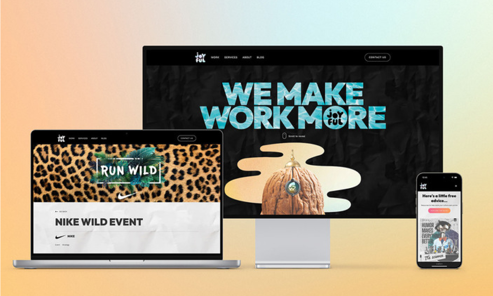
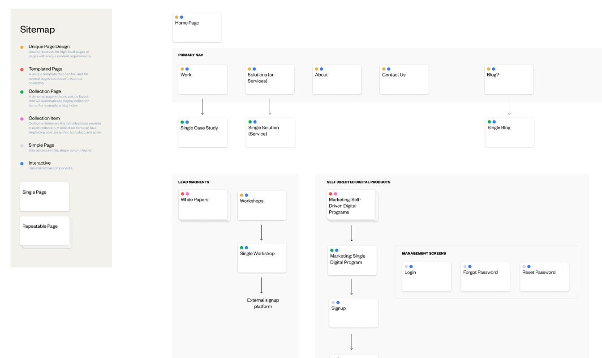
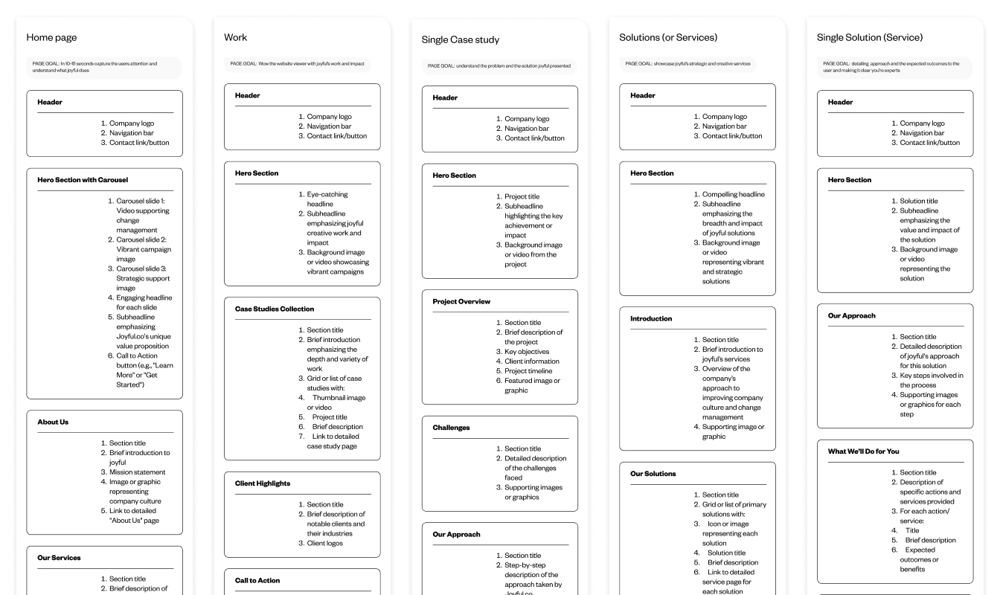
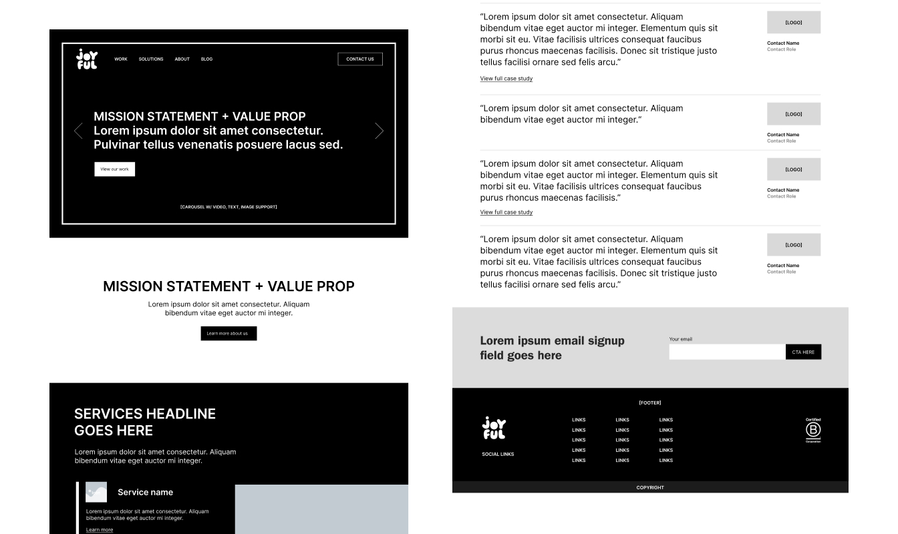
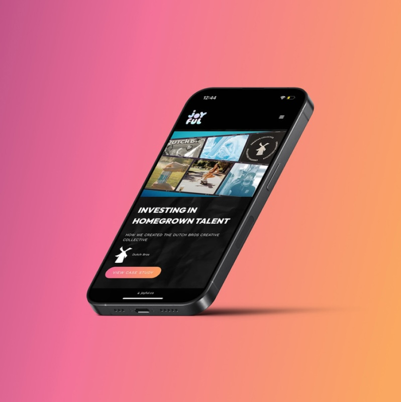
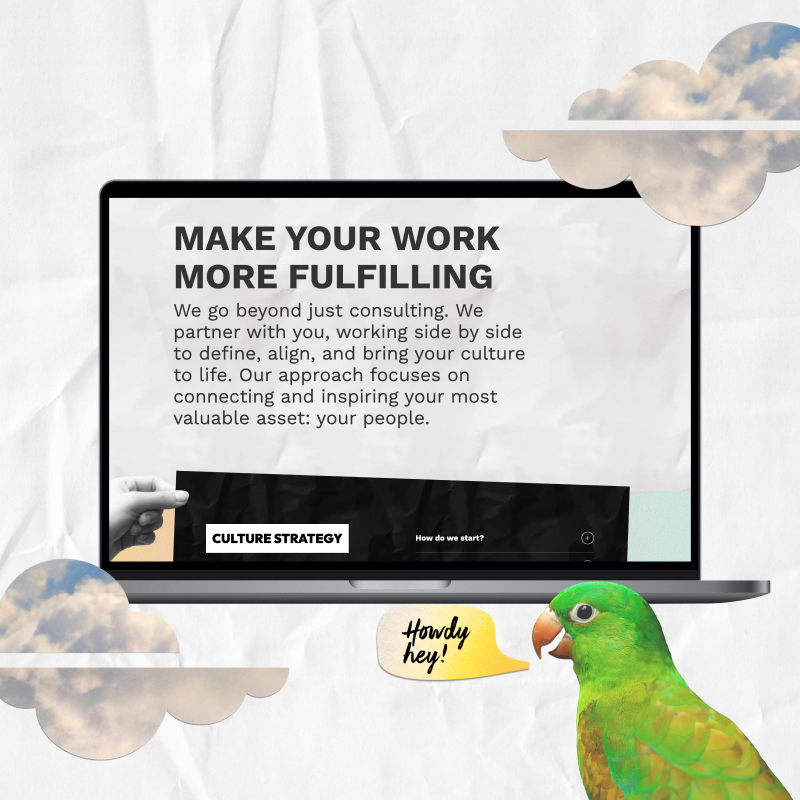

import video from './animation.mp4'

<Hero>
   <Container>
        <Block>
            <h1>{props.pageContext.frontmatter.title}</h1>
        </Block>
        <AssetImage>
            
        </AssetImage>
   </Container>
</Hero>

<Container>
    <Block>
        ## Summary
    </Block>
</Container>

<Container className="work-intro">
   <MainColumn>        
        <Block>
            ### Mission

            joyful.co is a work culture consultancy and agency. They are a highly creative team and needed to revamp their online presence to reflect the creative work they do for their clients. Their potential clients also had a hard time understanding their value offer and it was something they wanted to fix with a new design. They had really creative and tight brand guidelines that was great to work with.
        </Block>

        <Block>
            ### My Contributions

            I led the website design and build process, working closely with the client to align messaging, user flow, and visual identity. I created a streamlined, conversion-driven site on Webflow. I also built a scroll-driven animation with GSAP as a creative asset to showcase their quirky brand.
        </Block>
   </MainColumn>
   <Sidebar>
        <Block>
            ### Company

            joyful
            **via Good & Gold**
    
        </Block>
        <Block>
            ### Services

            - User Interface Design
            - Web Design
            - Webflow Development
            - Animation

        </Block>
        <Block>
            ### Tools & Tech

            - Figma
            - Webflow
            - Google Analytics
            - GSAP

        </Block>
   </Sidebar>
</Container>

<Container>
    <Block>
        

        
        ## Site Process

    </Block>
</Container>

<Container>
    <Block>
        ### Discovery & Structure

        We kicked things off with a collaborative discovery sprint to understand joyful’s unique voice, client journey, and service positioning. From there, I created a simplified sitemap and low-fidelity wireframes that focused on clarity and storytelling—helping guide users through their offer with ease.
    </Block>
    <Assets className="two-column">
        <AssetImage>
            
            *Sitemap*
        </AssetImage>
        <AssetImage>
            
            *Page manifests—a written guide for each page on the site*
        </AssetImage>
    </Assets>
    <Assets >
        <AssetImage>
            
            *Low-fidelity wireframes*
        </AssetImage>
    </Assets>
</Container>

<Container>
    <Block>
        ### Site design & Animation

        The design needed to walk the line between playful and polished. We leaned into their strong brand system—colorful, expressive, and bold—while keeping navigation and messaging straightforward. Expressive typography and whitespace gave the site its vibrant personality.
    </Block>
    <Assets className="two-column">
        <AssetImage>
            
        </AssetImage>
        <AssetImage>
            
        </AssetImage>
    </Assets>
</Container>

<Container>
    <Block>
        ### Site build

        Built entirely in Webflow, the site uses flexible, client-editable content blocks and a clean CMS setup. A standout feature is the scroll-driven GSAP animation on the homepage—a fun, interactive way to introduce the brand.
    </Block>
    <Assets>
        <AssetVideo src={video} />
    </Assets>
</Container>