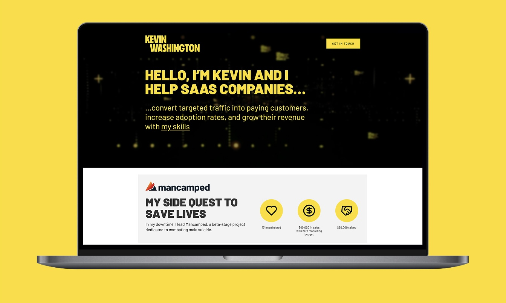
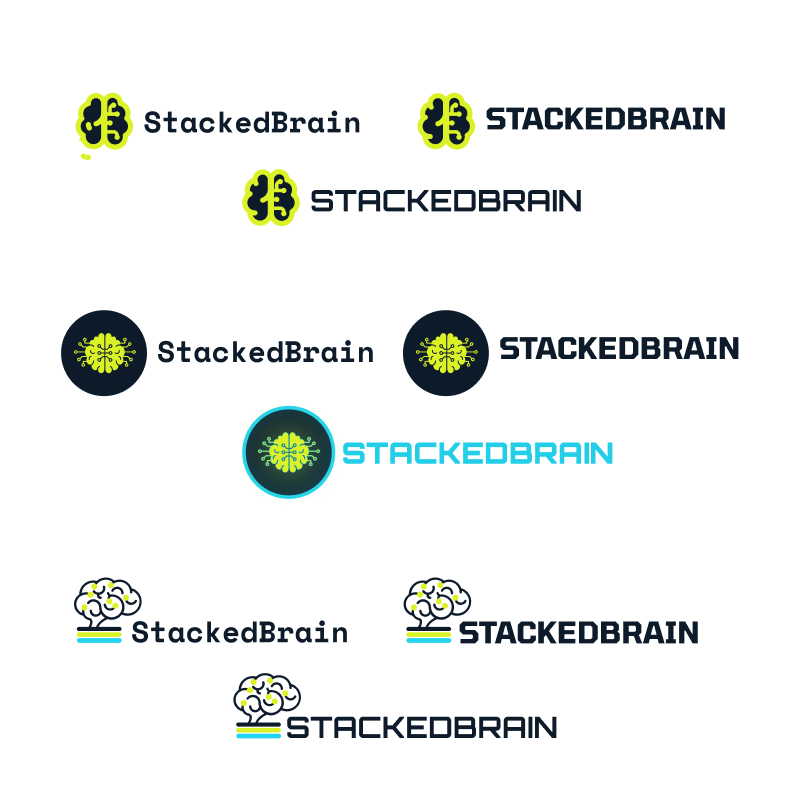
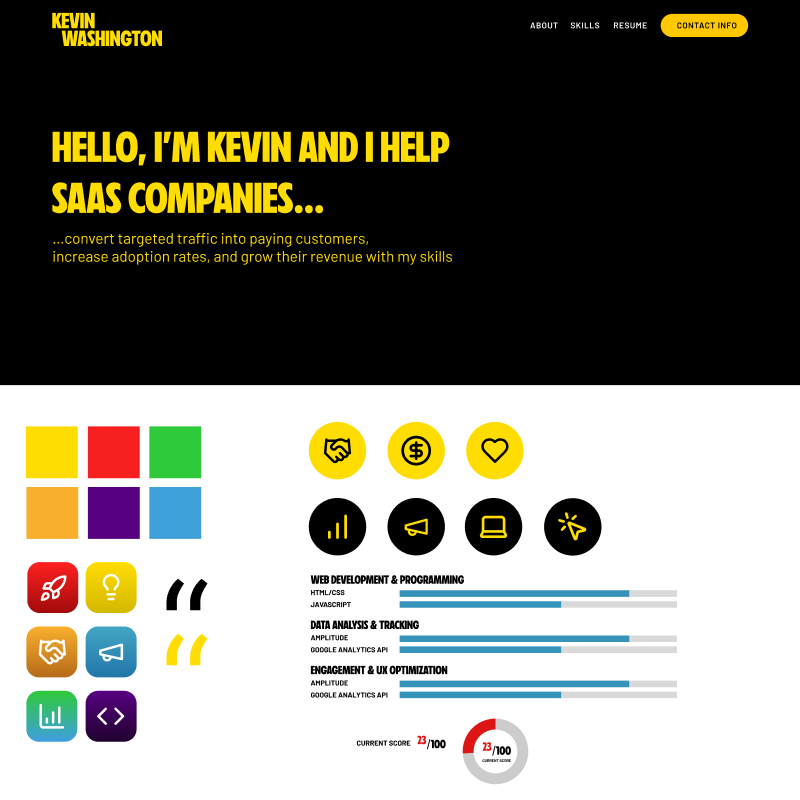
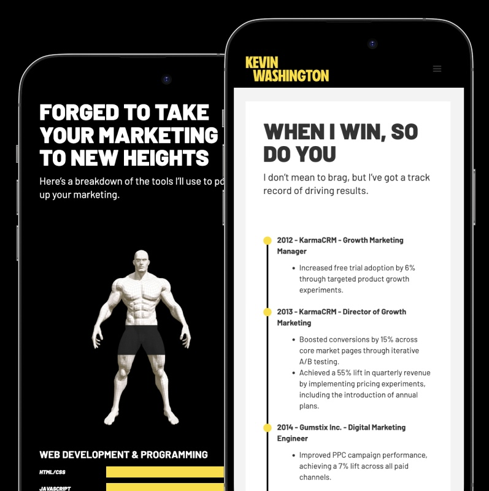
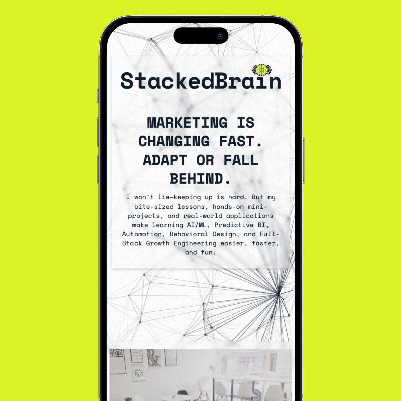

import animation from './animation-1.mp4'
import animation2 from './animation-2.mp4'

<Hero>
   <Container>
        <Block>
            <h1>{props.pageContext.frontmatter.title}</h1>
        </Block>
        <AssetImage>
            
        </AssetImage>
   </Container>
</Hero>

<Container>
    <Block>
        ## Summary
    </Block>
</Container>

<Container className="work-intro">
   <MainColumn>        
        <Block>
            ### Mission

            Kevin Washington is personal friend and business partner. He approached me for help on designing him a quick website to help him stand out in the job market. He also wanted to create a brand to showcase a personal initiative to learn new skills in public.
        </Block>

        <Block>
            ### My Contributions

            I developed some simple brands and built the sites in Webflow with his content expertise and vision. We were able to scale these up quickly
        </Block>
   </MainColumn>
   <Sidebar>
        <Block>
            ### Company

            Kevin Washington
        </Block>
        <Block>
            ### Services

            - User Interface Design
            - Web Design
            - Webflow Development
            - Animation

        </Block>
        <Block>
            ### Tools & Tech

            - Figma
            - Webflow
            - Javascript Animation Libraries

        </Block>
   </Sidebar>
</Container>

<Container>
    <Block>
        ## Impact
        
        The primary metric for this was getting a job and a brand the client was satisfied with!

        <Metrics>
            <Metric>
                ### 2
                
                Kevin ended up getting 2 job offers; 1 a part-time contract and 1 a full-time gig
            </Metric>
        </Metrics>
    </Block>
</Container>

<Container>
    <Block>
        

        
        ## 0-1 Journey

    </Block>
</Container>

<Container>
    <Block>
        ### Discovery & Structure

        We started with a quick discovery sprint to align on Kevin’s goals: build a simple but impactful personal brand and stand out in a competitive job market. He also wanted a way to document his journey of learning in public. We drafted a lightweight sitemap and shipped an MVP-style homepage quickly to get him in the game.
    </Block>
    <Assets className="two-column">
        <AssetImage>
            
            *Stacked Brain Logo Options*
        </AssetImage>
        <AssetImage>
            
            *Quick component and color study for the site*
        </AssetImage>
    </Assets>
</Container>

<Container>
    <Block>
        ### Site design & Animation

        The build was done in Webflow with reusability in mind, so Kevin could easily expand the site as his projects and skills evolved. We added a lightweight blog system for public learning notes, and used simple JS libraries for hover interactions and scroll effects. The final product was fast, mobile-friendly, and totally client-editable.
    </Block>
    <Assets className="two-column">
        <AssetVideo src={animation} />
         <AssetVideo src={animation2} />
    </Assets>
</Container>

<Container>
    <Block>
        ### Site build

        The build was done in Webflow with reusability in mind, so Kevin could easily expand the site as his projects and skills evolved. We added a lightweight blog system for public learning notes, and used simple JS libraries for hover interactions and effects. The final product was fast, mobile-friendly, and totally client-editable.
    </Block>
    <Assets className="two-column">
       <AssetImage>
            
            *Kevin Washington's Homepage on mobile*
        </AssetImage>
        <AssetImage>
            
            *Stacked Brain Site on mobile*
        </AssetImage>
    </Assets>
</Container>