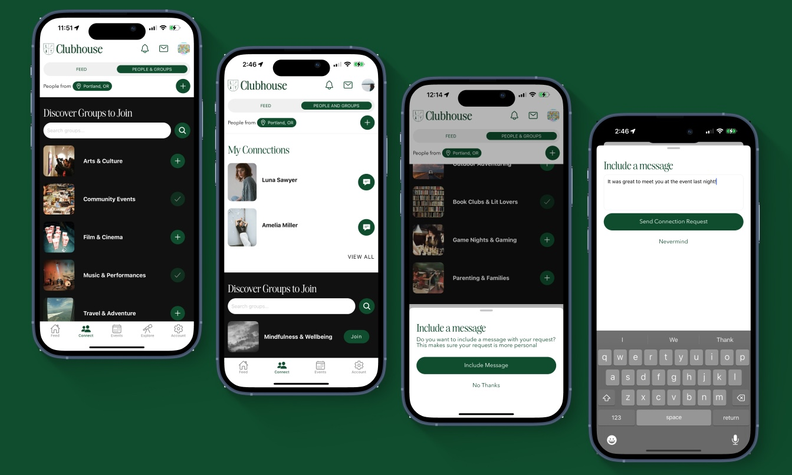
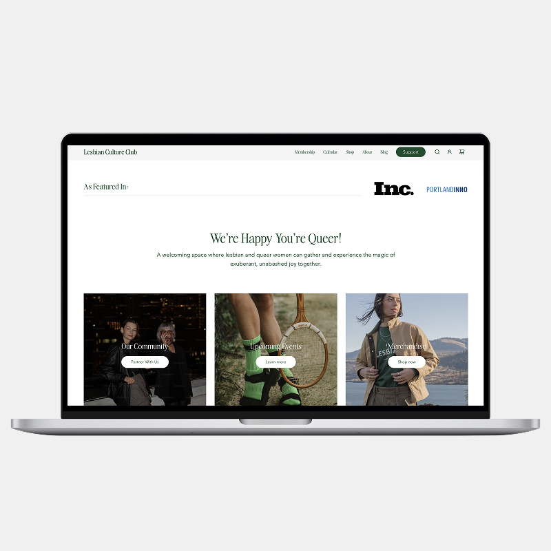
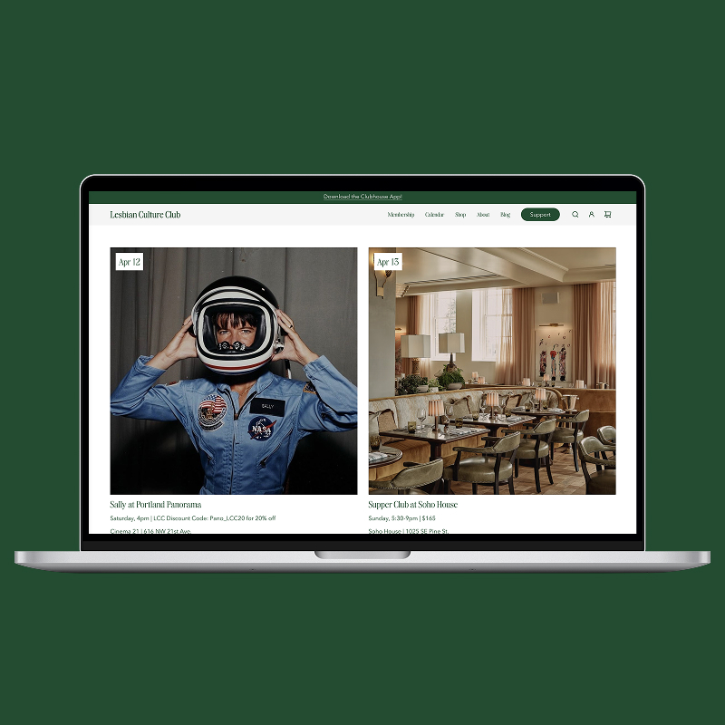
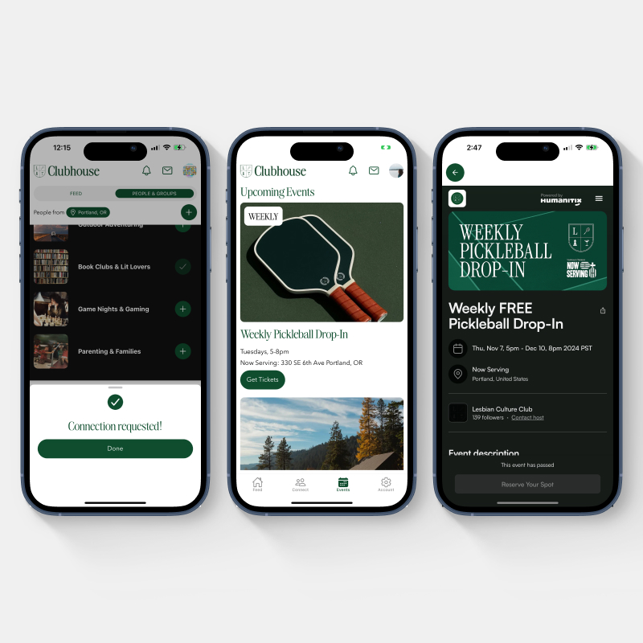
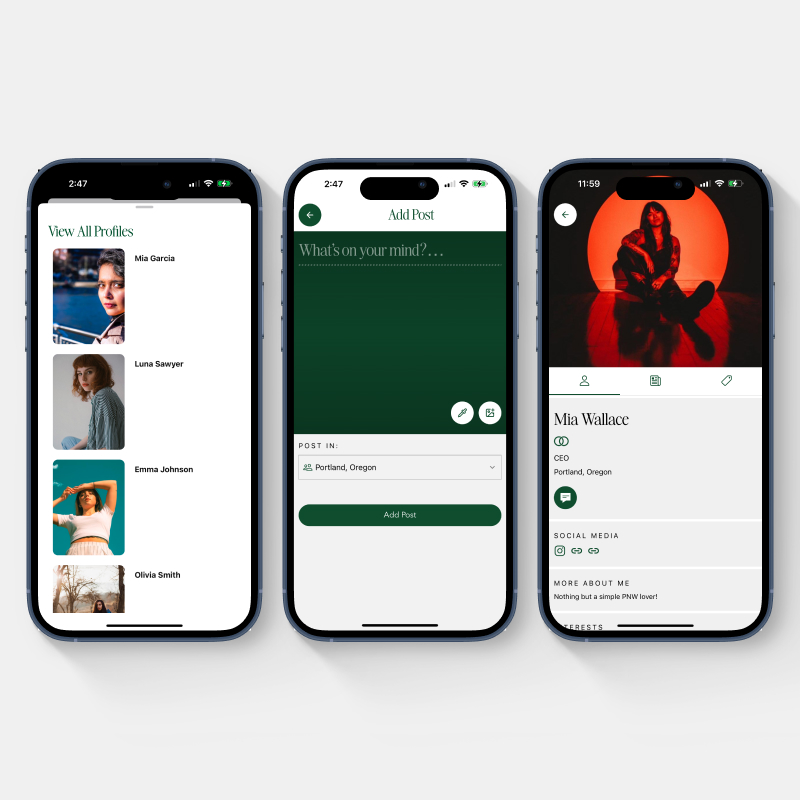
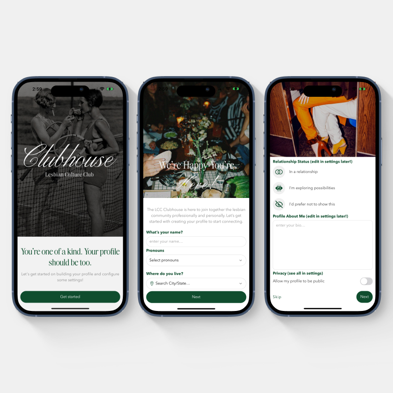

<Hero>
   <Container>
        <Block>
            <h1>{props.pageContext.frontmatter.title}</h1>
        </Block>
        <AssetImage>
            
        </AssetImage>
   </Container>
</Hero>

<Container>
    <Block>
        ## Summary
    </Block>
</Container>

<Container className="work-intro">
   <MainColumn>        
        <Block>
            ### Mission

            The Lesbian Culture Club emerged from a longing for dedicated spaces where queer women can gather and experience a deep sense of belonging and joy. Their mission is to create a dynamic and inclusive space where members can celebrate their identities, support one another, and build lasting connections.
        </Block>

        <Block>
            ### My Contributions

            I supported the founder in building out the application, marketing site and merch store. I handled every part of the product development flow as a nimble team of one to get the product from idea to app store in under 3 months
        </Block>
   </MainColumn>
   <Sidebar>
        <Block>
            ### Company

            Lesbian Culture Club
            **via Good & Gold**

        </Block>
        <Block>
            ### Services

            - User Interface Design
            - User Experience Design
            - User Research & User Flows
            - Wireframing
            - Web Design
            - Web Development 
            - Mobile App Development
            - Custom Analytics Development
        </Block>
        <Block>
            ### Tools & Tech

            - Figma
            - Next.JS
            - React Native
            - Supabase (database)
            - Resend (for email)
            - Amplitude (for analytics)
            - Expo and EAS

        </Block>
   </Sidebar>
</Container>

<Container>
    <Block>
        ## Impact
        
        The launch metrics so far:

        <Metrics>
            <Metric>
                ### 1,000+
                
                Day 1 signups after local news broadcast
            </Metric>
            <Metric>
                ### 3
                
                Months to launched MVP
            </Metric>
            <Metric>
                ### $10k
                
                In initial premium subscriptions
            </Metric>
        </Metrics>
    </Block>
</Container>

<Container>
    <Block>
        

        
        ## 0-1 Journey

    </Block>
</Container>

<Container>
    <Block>
        ### Marketing Site and E-commerce store

        We moved fast. To get Lesbian Culture Club online quickly, we skipped traditional wireframes and designed directly in the browser. Figma was only used when absolutely necessary for key components. This browser-first approach allowed us to iterate in real time with the founder and secure quick approvals.

        The marketing site and merch store were built to reflect the brand’s energy and values, while keeping conversion top of mind. I also implemented a custom Stripe integration to support their unique pricing model. This setup acted as the foundational infrastructure for the eventual app, capturing early interest and paid subscriptions while validating demand.
    </Block>
    <Assets className="two-column">
        <AssetImage>
            
        </AssetImage>
        <AssetImage>
            
        </AssetImage>
    </Assets>
</Container>

<Container>
    <Block>
        ### The App

        The app started with a handful of working sessions between me and the founder. She served as the voice of the customer, guiding features and priorities based on real community needs. We skipped polished mockups and instead tested working prototypes with actual users—getting fast, actionable feedback that shaped the experience.

        To move quickly, I used AI tools as a kind of junior developer—accelerating the build while I focused on architecture, flow, and polish. The app was designed end-to-end, including both frontend and backend logic via Next.js API routes. The founder needed to feel the product evolve in real time, which made the iterative, hands-on process essential to our success.
    </Block>
    <Assets className="two-column">
        <AssetImage>
            
        </AssetImage>
        <AssetImage>
            
        </AssetImage>
        <AssetImage>
            
        </AssetImage>
    </Assets>
</Container>