<Hero>
   <Container>
        <Block>
            <h1>{props.pageContext.frontmatter.title}</h1>
        </Block>
        <AssetImage>
            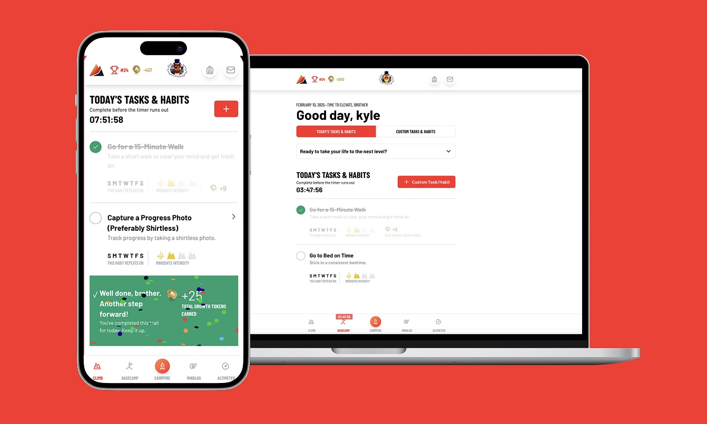
        </AssetImage>
   </Container>
</Hero>

<Container>
    <Block>
        ## Summary
    </Block>
</Container>

<Container className="work-intro">
   <MainColumn>        
        <Block>
            ### Mission

            Mancamped was born out my co-founder vision and my alignment to build a platform and ecosystem for men to become their peak selves. It is designed for men to be authentically themselves, tap into gamification, and create a place for men to vent, learn, and grow in our ever changing society. 
        </Block>

        <Block>
            ### My Contributions

            I have built upwards of 3 apps, mobile and web as we built out our offering. I designed and built multiple brands as we explored product market fit. As well supporting the team with sales automation, analytics, database management, and design as need for marketing initiatives.
        </Block>
   </MainColumn>
   <Sidebar>
        <Block>
            ### Company

            Mancamped
        </Block>
        <Block>
            ### Services

            - User Interface Design
            - User Experience Design
            - User Research & User Flows
            - Wireframing
            - Elixir development
            - Team and project management
            - A/B Testing & CRO
            - Web design
            - Webflow development
        </Block>
        <Block>
            ### Tools & Tech

            - Figma
            - Next.JS
            - React
            - React Native
            - Elixir (Phoenix Framework)
            - Webflow
            - Tailwind CSS
            - VWO (for A/B testing)
        </Block>
   </Sidebar>
</Container>

<Container>
    <Block>
        ## Impact
        
        Any metric we can drive forward to help men be better and save them from suicide is a positive metric. Here are some metrics we have been able to drive so far:

        <Metrics>
            <Metric>
                ### $60k
                
                In self generated revenue for the business
            </Metric>
            <Metric>
                ### 120+
                
                Initial users
            </Metric>
            <Metric>
                ### 12
                
                Weeks in Founders University; graduated from the program
            </Metric>
            <Metric>
                ### 500k
                
                Followers added to ex-influencer’s following
            </Metric>
        </Metrics>
    </Block>
</Container>

<Container>
    <Block>
        

        
        ## 0-1 Journey

    </Block>
</Container>

<Container>
    <Block>
        ### The Start

        My co-founder first approached me with some business ideas for us to tackle. We tried a couple but ended settling on creating a brand called Manframe. We built a mobile application and partnered with an influencer we had lined up to test. We drove traffic and iterated quickly on the product.
    </Block>
    <Assets>
        <AssetImage>
            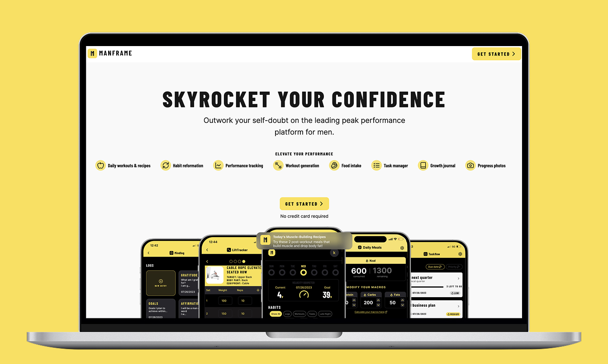
            *App & Landing page for Manframe, our initial product*
        </AssetImage>
    </Assets>
</Container>

<Container>
    <Block>
        ### Next Steps

        We quickly started to learn after weeks of iterating, we were on to something but we had some problems with adoption. We moved on to create  another brand and product strategy to better suit the market. We ended up generating most of our sales here, got even more traffic to resonate with our content and offering. We built out a robust sales funnel and process to get men onto the content and program we created. Interviewing users and monitoring test along the way.
    </Block>
    <Assets className="three-column">
        <AssetImage>
            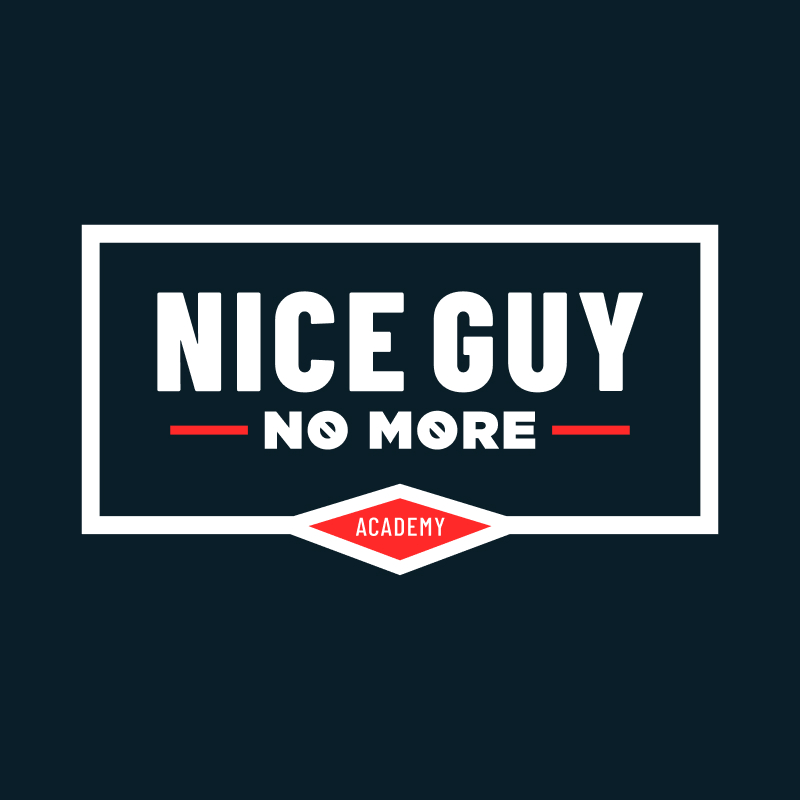
            *The new logo*
        </AssetImage>
       <AssetImage>
            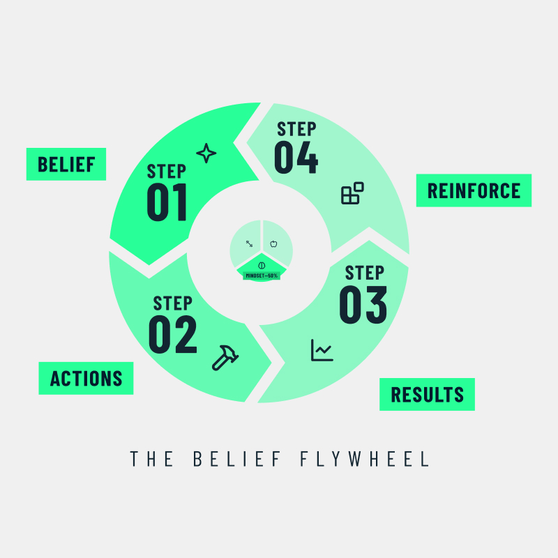
            *An image from one of the slide decks in our course*
        </AssetImage>
        <AssetImage>
            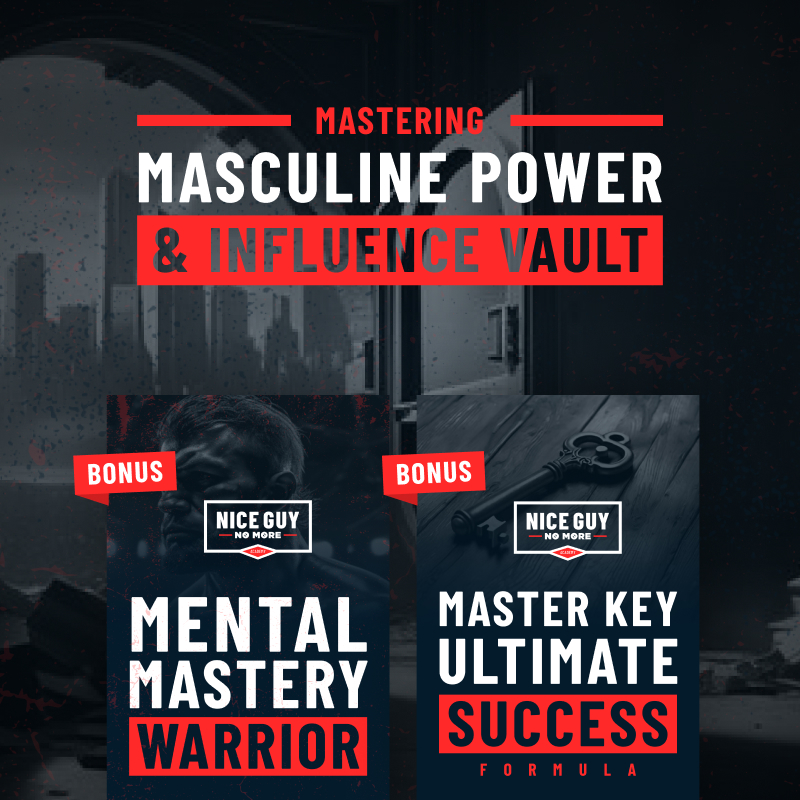
            *An image from one of the slide decks in our course*
        </AssetImage>
    </Assets>
</Container>

<Container>
    <Block>
        ### Enter Mancamped

        We started to realize, while we were having success, it would take a lot of human-hours and sales people to scale this business and we wanted to take a PLG approach to acquisition. Sales started to slow with the in-person approach, so we pivoted again to create a brand that was much more flexible and mature. Mancamped started to have success until our influencer ghosted the business and were left without a traction channel.
    </Block>
    <Assets className="two-column">
        <AssetImage>
            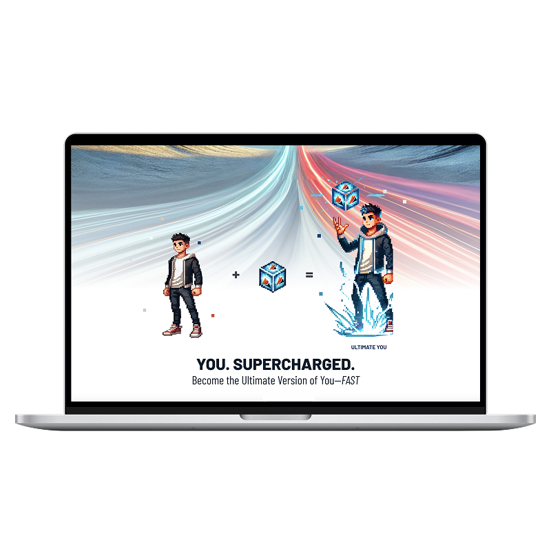
            *Portion of the Mancamped website*
        </AssetImage>
        <AssetImage>
            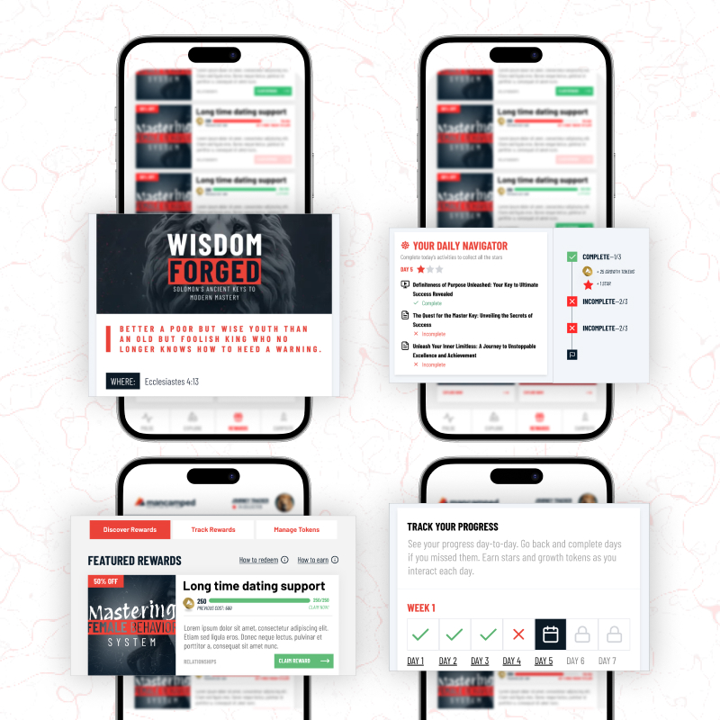
            *The app iteration*
        </AssetImage>
        <AssetImage>
            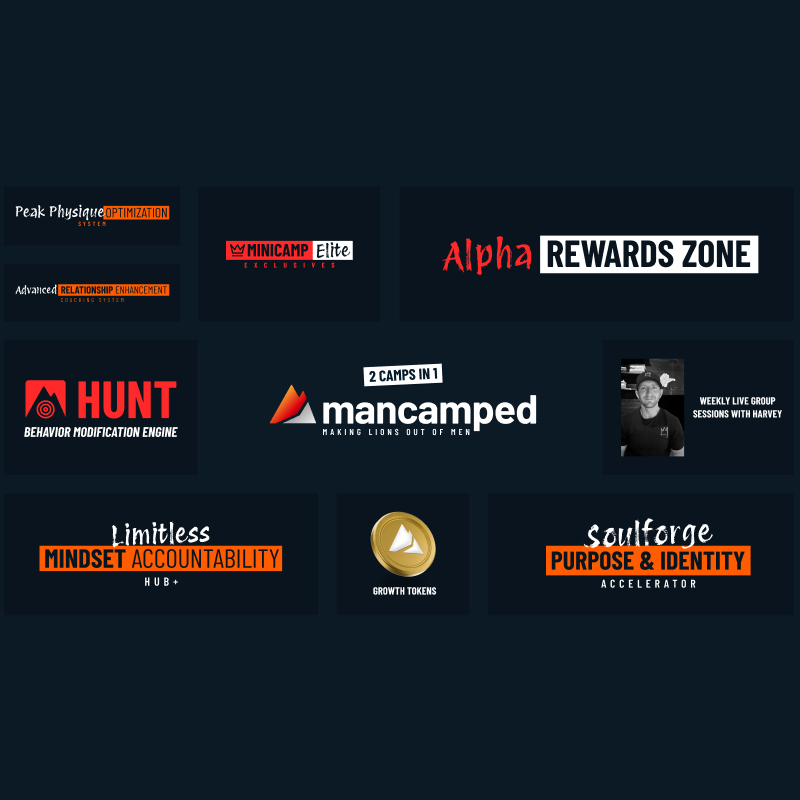
            *A slide from one of our slide decks*
        </AssetImage>
        <AssetImage>
            
            *One of the ads we tested*
        </AssetImage>
    </Assets>
</Container>

<Container>
    <Block>
        ### Founder’s U and Current Product
        
        Fast forward a few months of figuring out a new traction channel and graduating from Founder’s U, we tested paid advertising, kicked off SEO and started beta testing our newest iteration. We have a revamped sign up funnel that serves both as a data mine and a application process. We are running weekly calls with our users as part of the product offering and have a full suite of tools and more on the way to help guys grow and succeed—including my co-founder and myself.
    </Block>
    <Assets>
        <AssetImage>
            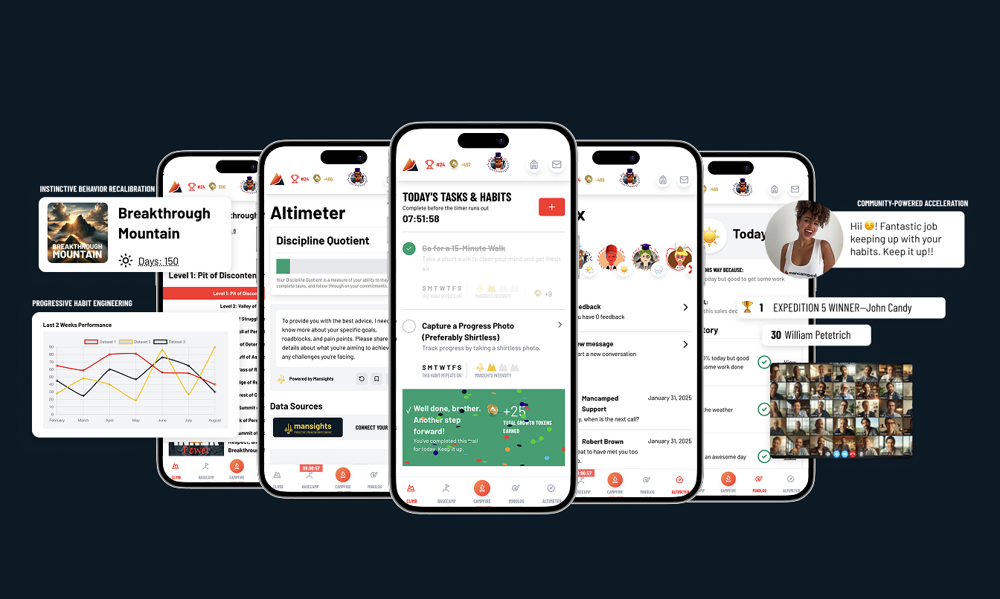
        </AssetImage>
        <AssetImage>
            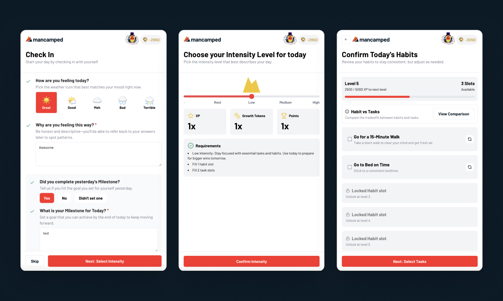
        </AssetImage>
        <AssetImage>
            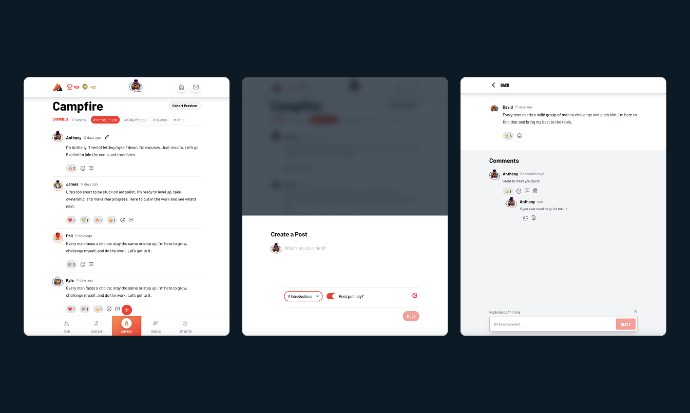
        </AssetImage>
        <AssetImage>
            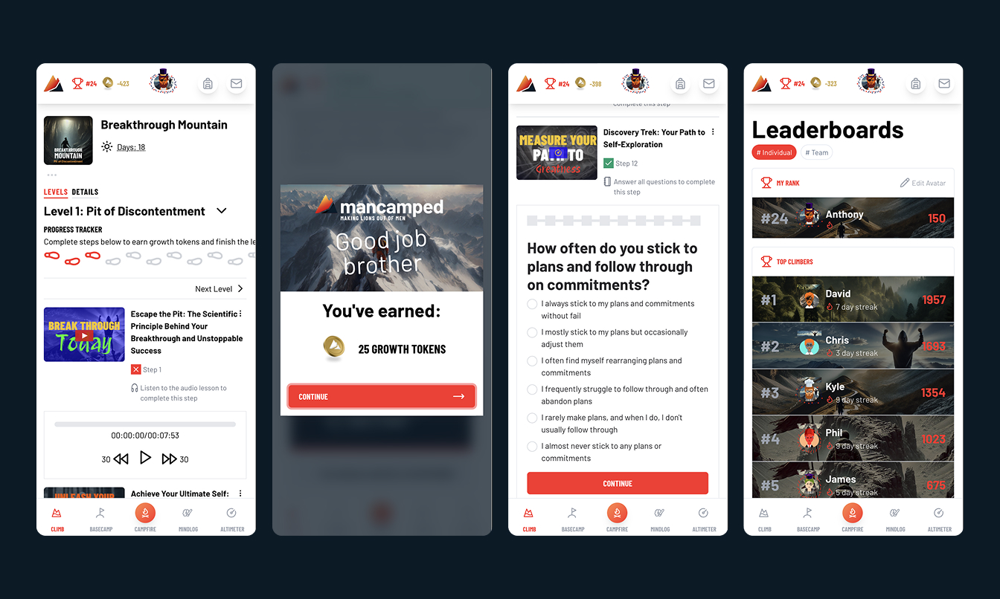
        </AssetImage>
    </Assets>
</Container>