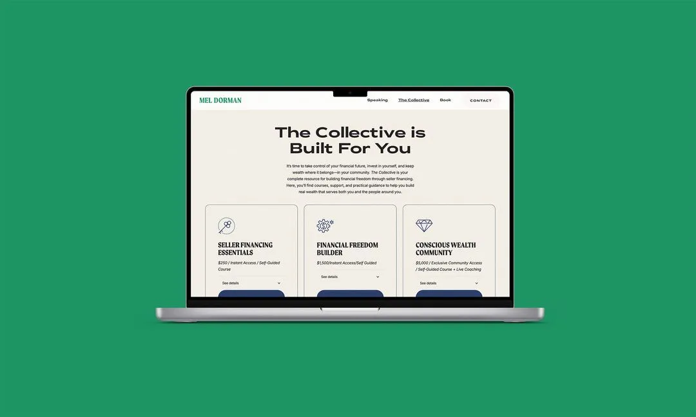

<Hero>
   <Container>
        <Block>
            <h1>{props.pageContext.frontmatter.title}</h1>
        </Block>
        <AssetImage>
            
        </AssetImage>
   </Container>
</Hero>

<Container>
    <Block>
        ## Summary
    </Block>
</Container>

<Container className="work-intro">
   <MainColumn>        
        <Block>
            ### Mission

            Mel Dorman is a financial activist, speaker, real estate broker, and educator focused on helping others build wealth with purpose. She approached for a site that could amplify her mission, support her offerings, and prepare for the visibility of her TEDxSouthLakeTahoe 2024 talk. Her previous digital footprint didn’t reflect her expertise or momentum—so we fixed that.
        </Block>

        <Block>
            ### My Contributions

            I led the website design and build process, working closely with the client to align messaging, user flow, and visual identity. I created a streamlined, conversion-driven site on Webflow, developed a simple brand system including logo and typography, and optimized the content and structure for SEO and lead capture.
        </Block>
   </MainColumn>
   <Sidebar>
        <Block>
            ### Company

            Mel Dorman
            **via Good & Gold**
        </Block>
        <Block>
            ### Services

            - User Interface Design
            - Web Design
            - Webflow Development

        </Block>
        <Block>
            ### Tools & Tech

            - Figma
            - Webflow
            - Google Search Console
            - Google Analytics

        </Block>
   </Sidebar>
</Container>

<Container>
    <Block>
        ## Impact
        
        Mel’s site launched just ahead of her TEDx appearance, positioning her brand and message clearly and professionally online. The simplified structure and clean UI made it easy for users to navigate her services and content.

        <Metrics>
            <Metric>
                ### 4x
                
                Increase in average session duration
            </Metric>
            <Metric>
                ### < 3 weeks
                
                Initial users
            </Metric>
            <Metric>
                ### 12
                
                Newsletter signup rate increase
            </Metric>
        </Metrics>
    </Block>
</Container>

<Container>
    <Block>
        

        
        ## Site Process

    </Block>
</Container>

<Container>
    <Block>
        ### Discovery & Structure

        We began with a quick round of discovery to understand Mel’s goals, offers, and audience. Based on this, I delivered a sitemap and wireframes.
    </Block>
</Container>

<Container>
    <Block>
        ### Site design

       The design emphasized clarity, energy, and trust. We paired bold headlines and clean layouts with warm, professional photography and iconography to communicate authority and approachability. We did most the design in Webflow directly.
    </Block>
    <Assets >
        <AssetImage>
            
        </AssetImage>
    </Assets>
</Container>

<Container>
    <Block>
        ### Site build

        The build was executed in Webflow using a modular structure so Mel and her team could easily update content going forward. We added an integration with Kit for her newsletters and setup the bones for Kajabi when Mel is ready to launch her course sales.
    </Block>
    <Assets >
        <AssetImage>
            
        </AssetImage>
    </Assets>
</Container>