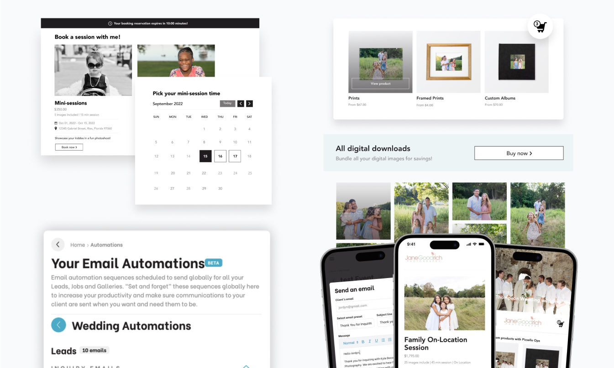
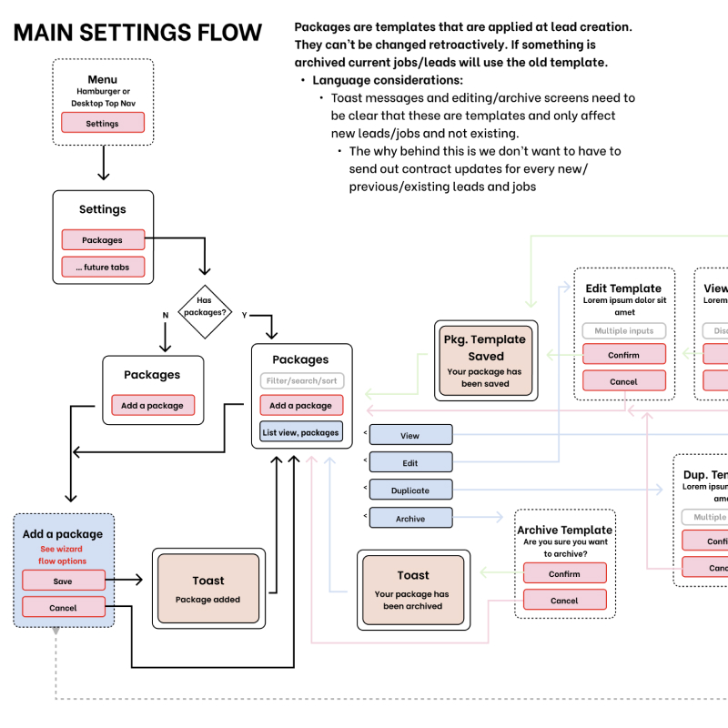
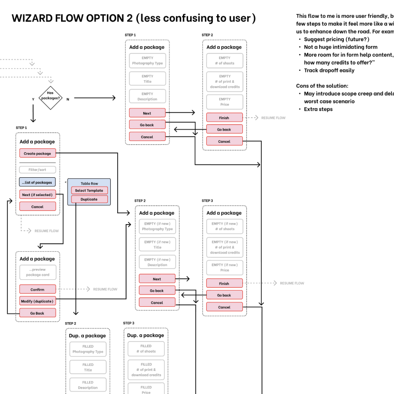
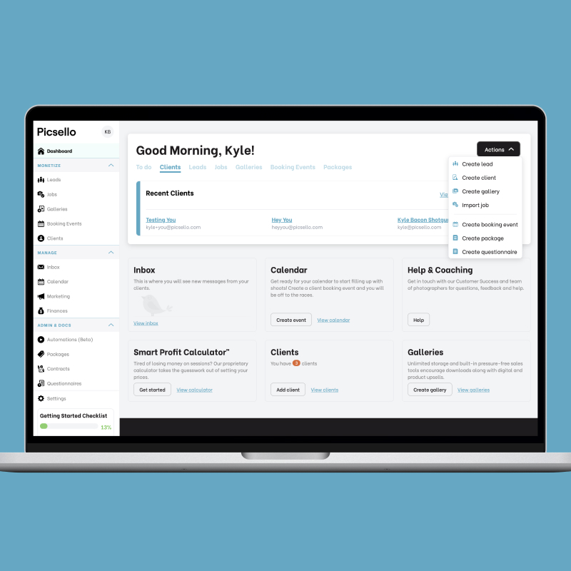
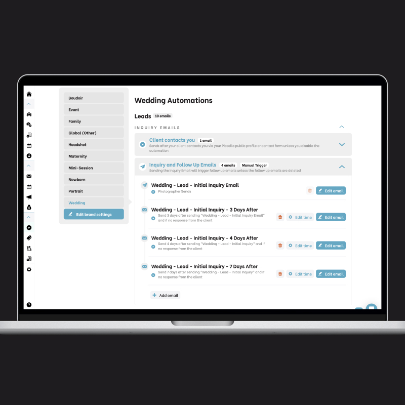
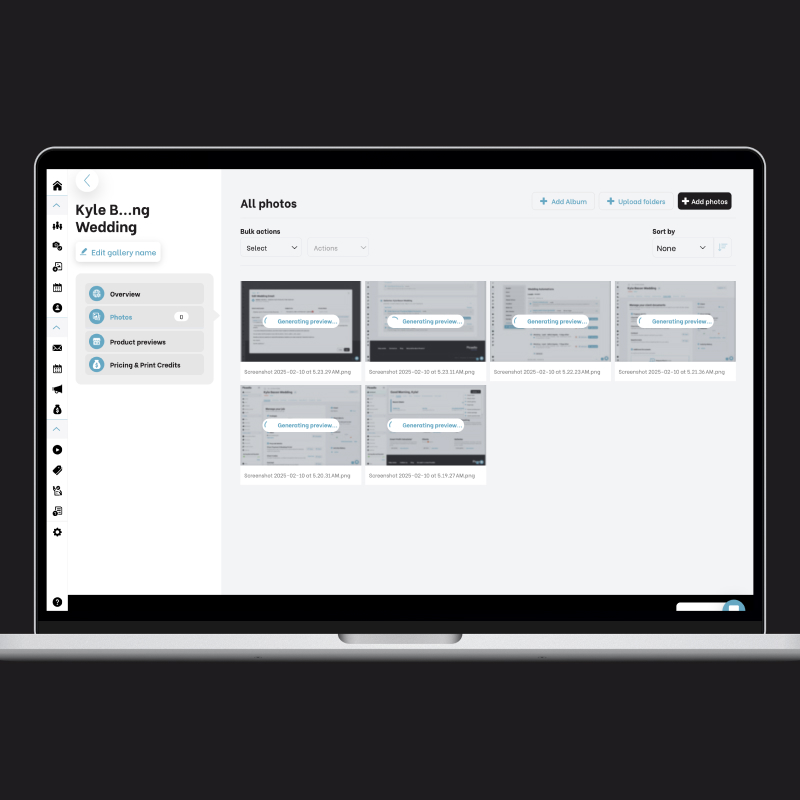
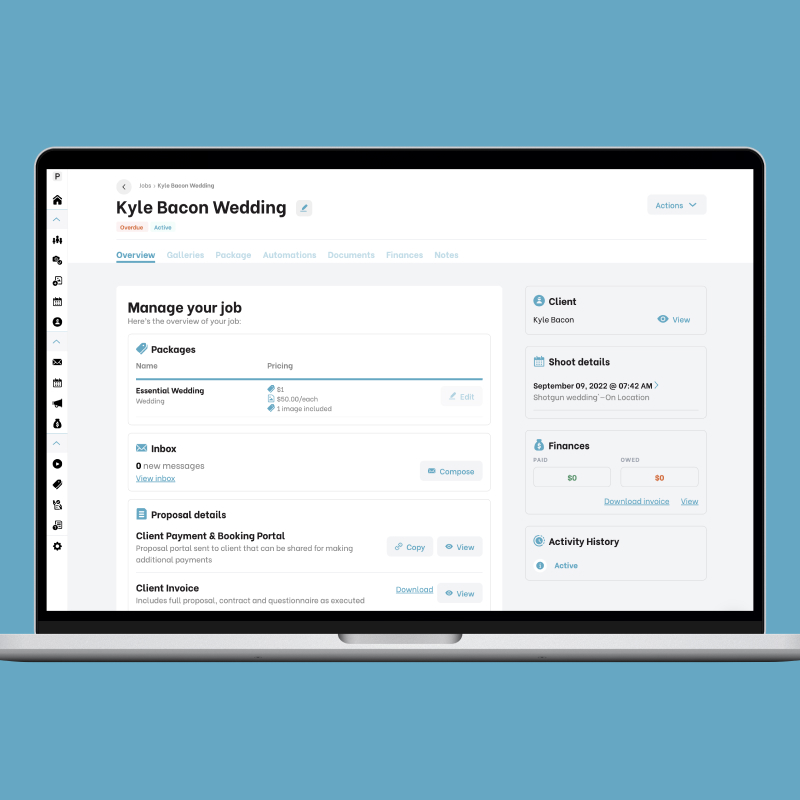
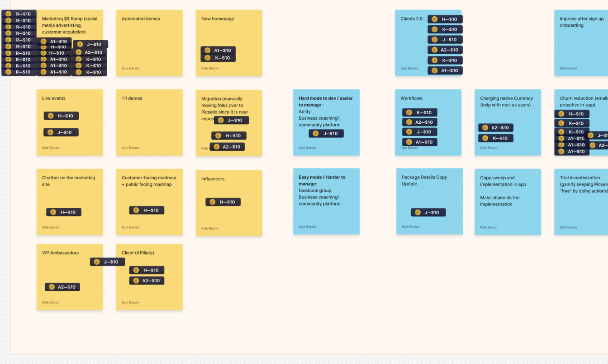
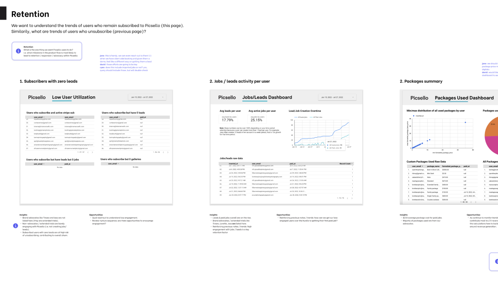
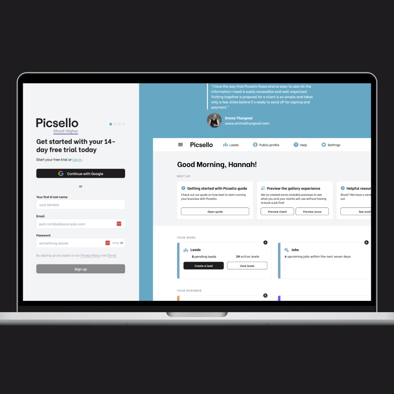

import video from './churn-fix.mp4'

<Hero>
   <Container>
        <Block>
            <h1>{props.pageContext.frontmatter.title}</h1>
        </Block>
        <AssetImage>
            
        </AssetImage>
   </Container>
</Hero>

<Container>
    <Block>
        ## Summary
    </Block>
</Container>

<Container className="work-intro">
   <MainColumn>        
        <Block>
            ### Mission

            Picsello was created to help photographers make more money doing what they love instead of focusing on the day-to-day operations of running a photography business. It operates and automates from start to finish, the entire workflow a photography business goes through. From capturing a lead on their website, to booking them, reminding of the shoot and finally gallery delivery and purchasing of digitals & prints.
        </Block>

        <Block>
            ### My Contributions

            I was employee number 4 at Picsello, and was with the business for 3 years swiftly leading and executing on the product vision. I took the web app through every stage of the UX design process, led a development team to ship the roadmap, and hoped in and coded to help accelerate the dev team and time-to-market. I am a Player/Coach leader at heart. I also contributed to the marketing site through design and development.
        </Block>
   </MainColumn>
   <Sidebar>
        <Block>
            ### Company

            Picsello
        </Block>
        <Block>
            ### Services

            - User Interface Design
            - User Experience Design
            - User Research & User Flows
            - Wireframing
            - Elixir development
            - Team and project management
            - A/B Testing & CRO
            - Web design
            - Webflow development
            - SEO

        </Block>
        <Block>
            ### Tools & Tech

            - Elixir (Phoenix Framework)
            - Google Cloud Platform
            - Webflow
            - Mailchimp
            - Sendgrid
            - Tailwind CSS
            - Render
            - Postgres
            - Figma
            - Lyssna (User Testing)

        </Block>
   </Sidebar>
</Container>

<Container>
    <Block>
        ## Impact
        
        The initial launch had a large amount of churn within the user base, further iterations and a strike team I led was deployed for these final metrics:

        <Metrics>
            <Metric>
                ### -50%
                
                The amount churn was reduced
            </Metric>
            <Metric>
                ### 7k
                
                Visitors to the marketing site organically
            </Metric>
            <Metric>
                ### 150+
                
               Initial subscribers to the web app upon launch
            </Metric>
            <Metric>
                ### 8
                
                Developers managed
            </Metric>
            <Metric>
                ### 6
                
                Huge features shipped quickly after launch
            </Metric>
        </Metrics>
    </Block>
</Container>

<Container>
    <Block>
        

        
        ## Iterating the MVP

    </Block>
</Container>

<Container>
    <Block>
        ### Discovery & Background

        The CEO was a seasoned photographer who ran a successful photography business. In 2020, she realized, with no work because of the pandemic, she was still managing the business with fragmented and overpriced tools. She fired up a survey to 5000+ photographers and the idea was born. She started to form the team and before jumping into design, I analyzed all of the data, competitive landscape, and ran some user interviews on that pool of photographers to begin scoping and understanding their jobs-to-be-done.
    </Block>
</Container>

<Container>
    <Block>
        ### Workflow/UX

        In theory, building a vertical SaaS with a CRM as the base and a photo uploader is easy, but in reality, the photography world has some tight workflows they like to work through.The software had to both be opinionated and flexible to meet the varying needs of the user base. One major educator taught things should be done this way, while another preached another one. Then there’s different types of photographers, those that do “In Person Sales” vs. those who take wedding photos on the weekend as a side gig. I meticulously studied those workflows and created diagrams for the team to agree upon and run past users.
    </Block>
    <Assets className="two-column">
        <AssetImage>
            
            *image_caption*
        </AssetImage>
        <AssetImage>
            
            *image_caption*
        </AssetImage>
    </Assets>
</Container>

<Container>
    <Block>
        ### UI Design

        The goal of the UI design was to be simple and clean. No frills on the photographer’s view and a clean client frontend for when photographers were sending out proposals and automated booking flows. A consistent component library was leveraged to apply across all flows and UX to speed up development and keep consistency top of mind.
    </Block>
    <Assets className="two-column">
        <AssetImage>
            
        </AssetImage>
        <AssetImage>
            
        </AssetImage>
        <AssetImage>
            
        </AssetImage>
        <AssetImage>
            
        </AssetImage>
    </Assets>
</Container>

<Container>
    <Block>
        ### Continuous User Research
        
        One should trust their gut to a certain extent when building a new product, but I am a big believer in running ideas, mocks, and flows across users, a) this saves development budget if you’re wrong and b) makes sure you are solving the right problem at the right time. I leveraged Lyssna and Figma prototypes to quickly iterate flows and capture user feedback to keep the product development flow tight. Certain times I would also build the feature in code really quick and provide a live prototype behind a feature flag to our Photography Advisory Board that I spearheaded creating. Between Figma mocks and live prototypes, we typically shipped features that users already loved.
    </Block>
    <Assets>
        <AssetImage>
            
        </AssetImage>
    </Assets>
</Container>

<Container>
    <Block>
        

        
        ## Busting Churn

    </Block>
</Container>

<Container>
    <Block>
        ### Data analysis
        
        When Picsello first launched, we noticed we had a decent conversion rate, but folks weren’t sticking around and if they did, they’d churn after the 14 day trial. This was seen in GA4 and our Stripe data. I suggested the business settle on what an activated user was:

        - Stripe Connect setup
        - 1 job booked
            - Dollars ran through the system
        - 2 galleries uploaded
            - (Most tire-kickers would upload and preview a gallery day 1 to see if it fit their needs)

        After building an analytics dashboard to uncover the problem, we set out to interview users to get some qualitative data via closed/won interviews. The churners who took the incentive, iterated that they were overwhelmed with transferring software or starting from scratch.
    </Block>
    <Assets>
        <AssetImage>
            
        </AssetImage>
    </Assets>
</Container>

<Container>
    <Block>
        ### The Fix
        
        After further analysis and doing some closed/won interviews with churners who took the incentive to talk to us, I landed on creating a simplified checklist of things they need to do to get setup quickly in the software. It was baked with gamification and reward functions, users loved it and I was able to reduce churn by 50%. We doubled down on this by revamping our onboarding sequence, offering white-glove transfer services as an upsell, and leveraged Intercom to help at certain touchpoints in addition to the checklist.
    </Block>
    <Assets>
       <AssetVideo src={video} />
    </Assets>
</Container>

<Container>
    <Block>
        

        
        ## The Marketing Site

    </Block>
</Container>

<Container>
    <Block>
        ### Simple Funnel
        
        As with the UI design, a big tenant of the brand is to be simple and transparent. We ditched the complex pricing table competitors had, lowered the price, gave unlimited gallery storage for the price. We spoke and designed in clean language. Photographers are a strong-minded and critical audience—that forced us to be clean and solid.
    </Block>
    <Assets className="two-column">
        <AssetImage>
            
        </AssetImage>
        <AssetImage>
            
        </AssetImage>
    </Assets>
</Container>

<Container>
    <Block>
        

        
        ## Challenges

    </Block>
</Container>

<Container>
    <Block>
        ### Funding Demise and Crowded Space
        
        In all transparency, the company ended up not closing a series A and the lights are still on for the users who adopted before marketing stopped. The competitors also woke up and started shipping product they should’ve shipped years ago (most the players were in the space for 10+ years) thanks to some of what we were innovating. This was a fantastic product to work on for 3 years and was great to grow as a leader and shipping a 0-1 product quickly.
    </Block>
</Container>