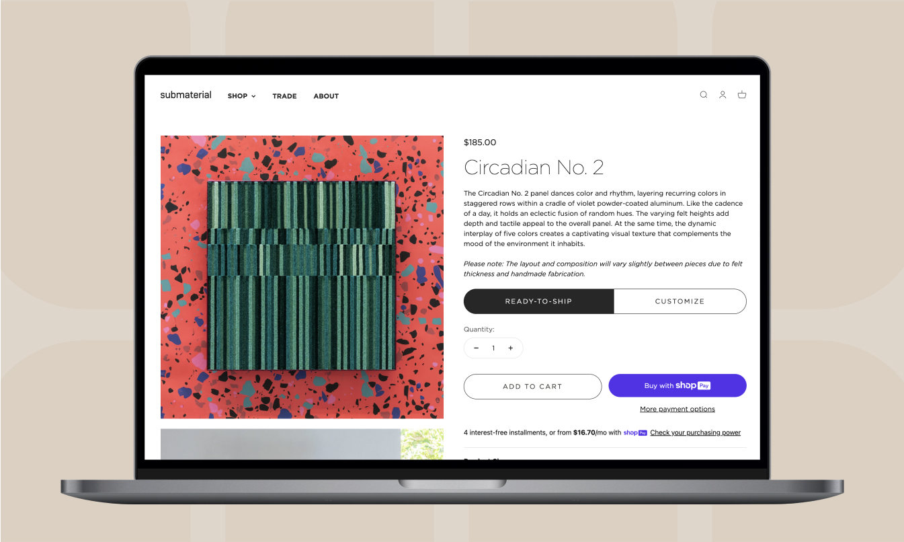
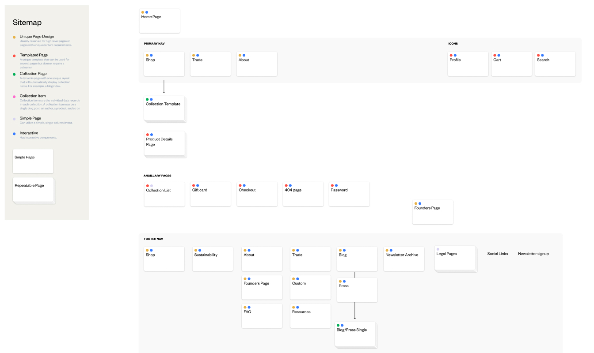
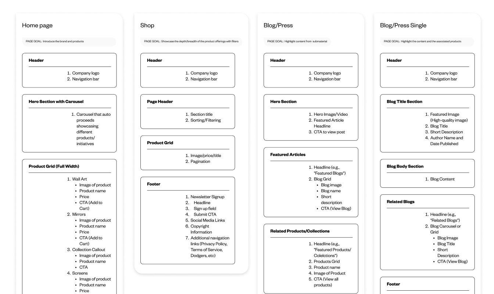
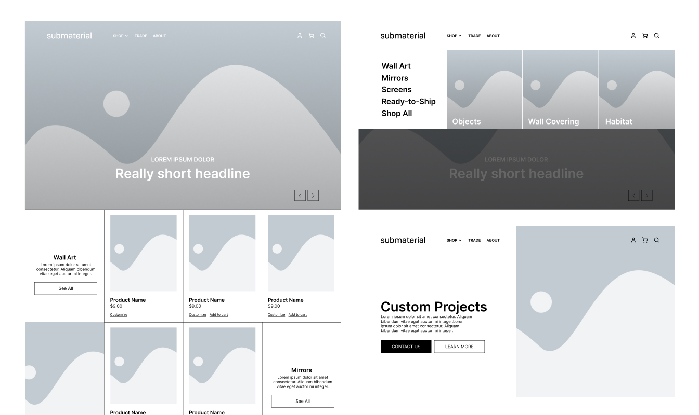
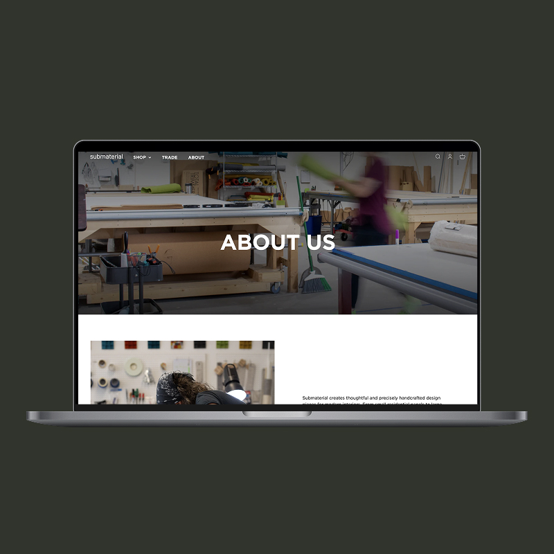
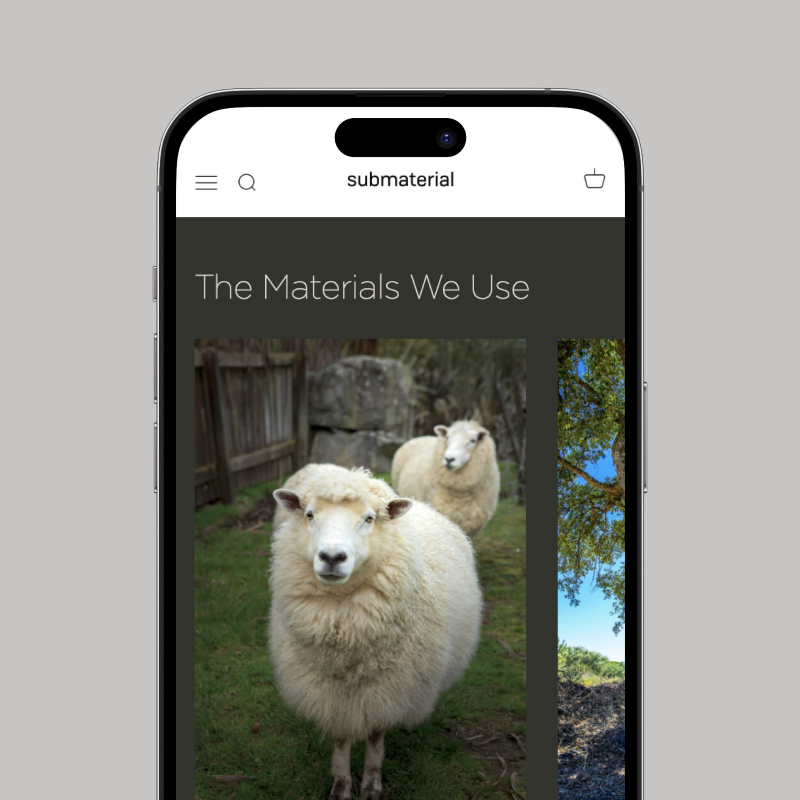
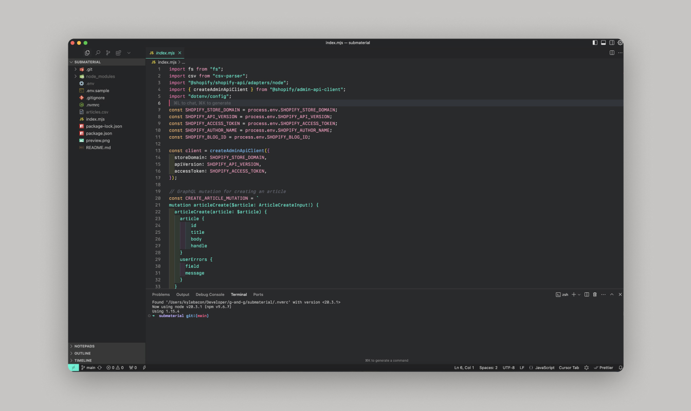

import submaterial from './submaterial.mp4'

<Hero>
   <Container>
        <Block>
            <h1>{props.pageContext.frontmatter.title}</h1>
        </Block>
        <AssetImage>
            
        </AssetImage>
   </Container>
</Hero>

<Container>
    <Block>
        ## Summary
    </Block>
</Container>

<Container className="work-intro">
   <MainColumn>        
        <Block>
            ### Mission

            submaterial is a company based in New Mexico that creates physical work out a myriad of materials to decorate your home, create a premium entry experience to buildings and much more. “Through the work [they] make by hand, [they] want to make a world worth handing down.” Their portfolio and products is of ultra high quality, their site didn’t reflect that.
        </Block>

        <Block>
            ### My Contributions

            I was the lead web designer and developer on the project. I helped them define their site architecture all the way to the UI design and finally the actual setup and execution of within Shopify. I also provided extensive training to the team upon launch so they were comfortable with their new site
        </Block>
   </MainColumn>
   <Sidebar>
        <Block>
            ### Company

            submaterial 
            **via Good & Gold**

        </Block>
        <Block>
            ### Services

            - User Interface Design
            - User Experience Design
            - Wireframing
            - Web design
            - Shopify development

        </Block>
        <Block>
            ### Tools & Tech

            - Webflow
            - Figma
            - Javascript
            - Shopify
        </Block>
   </Sidebar>
</Container>

<Container>
    <Block>
        ## Impact
        
        Most of their work comes offline through their sales team, but they’ve always wanted to sell more premade products.

        <Metrics>
            <Metric>
                ### 3x
                
                Increase in online sales
            </Metric>
            <Metric>
                ### -4s
                
                The decrease in site speed after the site launched
            </Metric>
            <Metric>
                ### 300+
                
                Pages, products and blog posts transitioned
            </Metric>
        </Metrics>
    </Block>
</Container>

<Container>
    <Block>
        

        
        ## Site Process

    </Block>
</Container>

<Container>
    <Block>
        ### Wireframes & Page Manifests

        After doing a round of discovery with the client to understand their needs, I came up with a sitemap, wireframes, and page manifests to structure their site
    </Block>
    <Assets className="two-column">
        <AssetImage>
            
            *submaterial sitemap*
        </AssetImage>
        <AssetImage>
            
            *submaterial page manifests*
        </AssetImage>
    </Assets>
    <Assets>
        <AssetImage>
            
            *submaterial wireframes*
        </AssetImage>
    </Assets>
</Container>

<Container>
    <Block>
        ### Site design

        After the client approved the above with some feedback rounds, it was time for the actual site design. The goal of the design was to showcase their photographed products in a meaningful way and keep shopability top of mind, but not in your face.
    </Block>
    <Assets className="two-column">
        <AssetImage>
            
        </AssetImage>
        <AssetImage>
            
        </AssetImage>
    </Assets>
</Container>

<Container>
    <Block>
        ### Site build

        The site build was a standard Shopify 2.0 build out, with a focus on client-first maintainability. A custom logo scroll was created for all of their clients since they have so many. Focus on high-quality photography and video was a challenge for site speed. A custom feature for the Product Detail Pages was created for the products they only sell via a personal sales process vs. self-serve purchasing.

        I also built some custom tools to export their blog posts and other content from their previous Wordpress site. A lot of the apps on the Shopify app store are paid, and we wanted to save on cost.
    </Block>
    <Assets>
        <AssetImage>
            
        </AssetImage>
    </Assets>
    <Assets>
        <AssetVideo src={submaterial} />
    </Assets>
</Container>