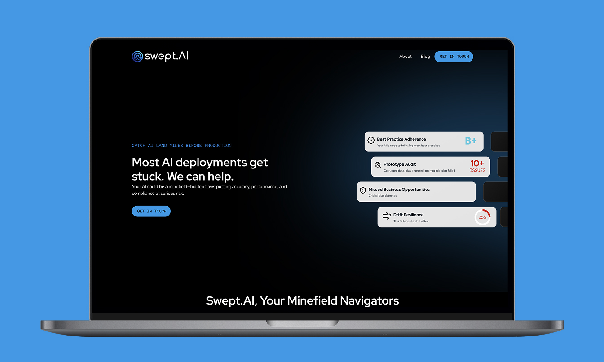
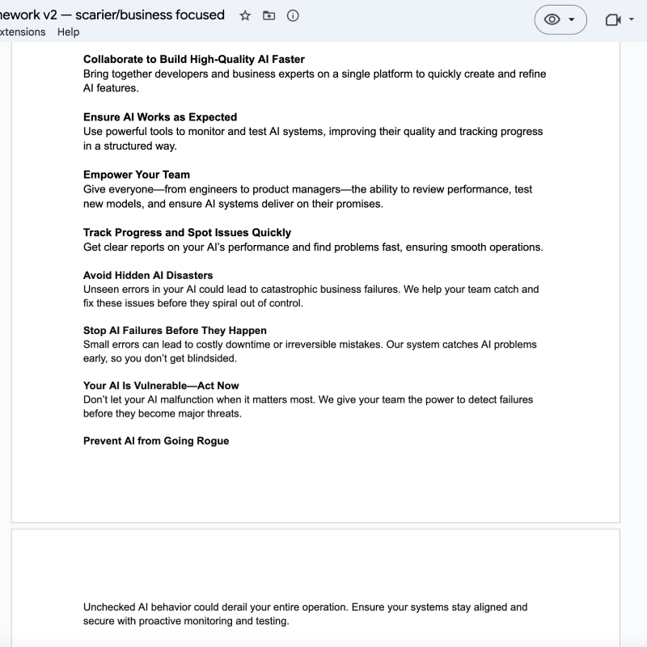
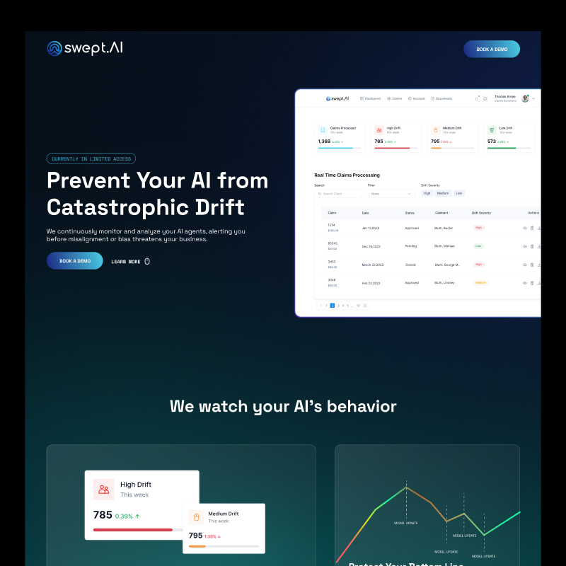
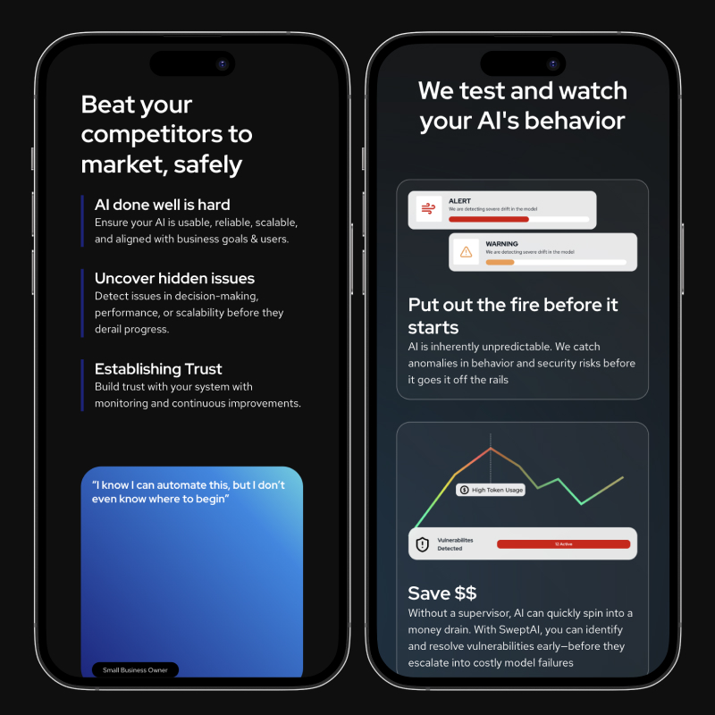
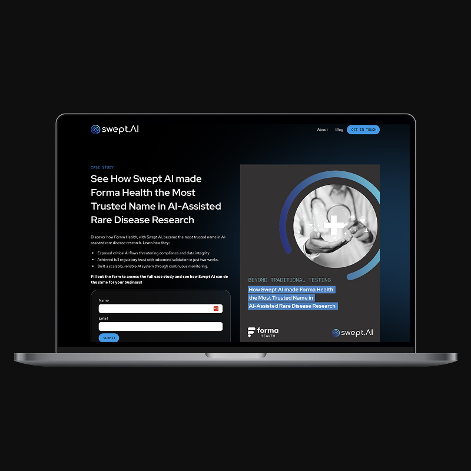

<Hero>
   <Container>
        <Block>
            <h1>{props.pageContext.frontmatter.title}</h1>
        </Block>
        <AssetImage>
            
        </AssetImage>
   </Container>
</Hero>

<Container>
    <Block>
        ## Summary
    </Block>
</Container>

<Container className="work-intro">
   <MainColumn>        
        <Block>
            ### Mission

            Swept AI formed to make AI work well for humanity. Swept AI, believes that artificial intelligence has the power to greatly improve the world, but only if it is used effectively. Hallucinations, LLM jailbreaks, prompt injections, are just a few of many of the issues we see as getting in the way of AI doing the best job it can.
        </Block>

        <Block>
            ### My Contributions

            I led the website design and build process, working closely with the client to align messaging, user flow, and visual identity. The hardest part of this project was aligning on messaging and the value offer. They are still refining the product and finding Product Market Fit. We meet weekly to make sure the site is currently where it needs to be based on their current context. I also scaffolded out the SEO strategy and handle execution of evergreen blog posts and continuous monitoring of keywords and site position.
        </Block>
   </MainColumn>
   <Sidebar>
        <Block>
            ### Company

            swept.ai
        </Block>
        <Block>
            ### Services

            - User Interface Design
            - Web Design
            - Webflow Development
            - Animation
            - SEO
            - Content Development
        </Block>
        <Block>
            ### Tools & Tech

            - Figma
            - Webflow
            - Google Analytics
            - Ahrefs
            - Google Search Console
            - GSAP

        </Block>
   </Sidebar>
</Container>

<Container>
    <Block>
        ## Impact
        
        Initially the goal of the site was to bring in customers, but a cold sales outreach didn’t end up working to drive to the site. It ended up being a great tool for investors to learn about the company and showcase the offer. Swept just recently closed their pre-seed round. We are setting the site up for keywords that might become popular in the future.
    </Block>
</Container>

<Container>
    <Block>
        

        
        ## Site Process

    </Block>
</Container>

<Container>
    <Block>
        ### Discovery & Structure

        We began with a series of strategy sessions to help Swept AI define their core messaging, user personas, and evolving product value. Because they’re still actively developing their platform, flexibility was key. I created a living sitemap and got a simple homepage shipped right away.
    </Block>
    <Assets className="two-column">
        <AssetImage>
            
            *Discovery & messsaging document*
        </AssetImage>
        <AssetImage>
            
            *Initial homepage*
        </AssetImage>
    </Assets>
</Container>

<Container>
    <Block>
        ### Site design & Animation

        The design leaned into a clean, modern tech aesthetic—lightweight, fast, and human-centered. We used subtle animation and microinteractions to add polish without distraction. A GSAP-powered animation helps visualize the risks in today’s AI landscape and how Swept AI aims to solve them. Typography and layout were optimized for clarity, trust, and future scalability.
    </Block>
    <Assets>
        <SweptAnimation />
    </Assets>
</Container>

<Container>
    <Block>
        ### Site build

        The site was built in Webflow using a scalable, CMS-driven structure to support ongoing content updates and future product launches. I also built in SEO-friendly components and optimized the structure for indexability. Integrated analytics and keyword tracking tools (Ahrefs + Search Console) were connected to actively monitor site performance. A blog system was also implemented to support their evergreen content strategy, which I continue to lead.
    </Block>
    <Assets className="two-column">
        <AssetImage>
            
        </AssetImage>
        <AssetImage>
            
        </AssetImage>
    </Assets>
</Container>