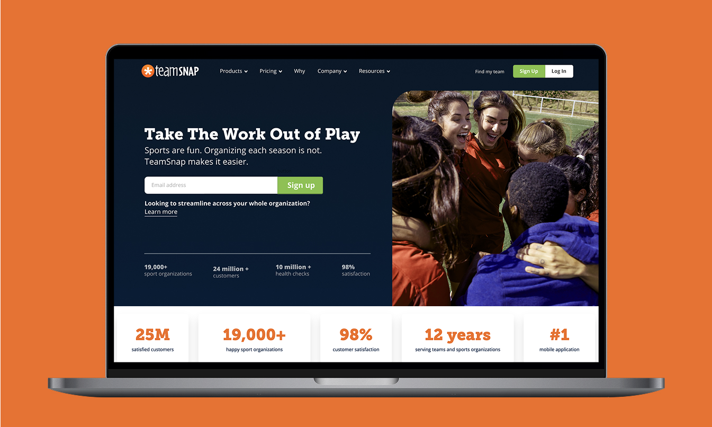
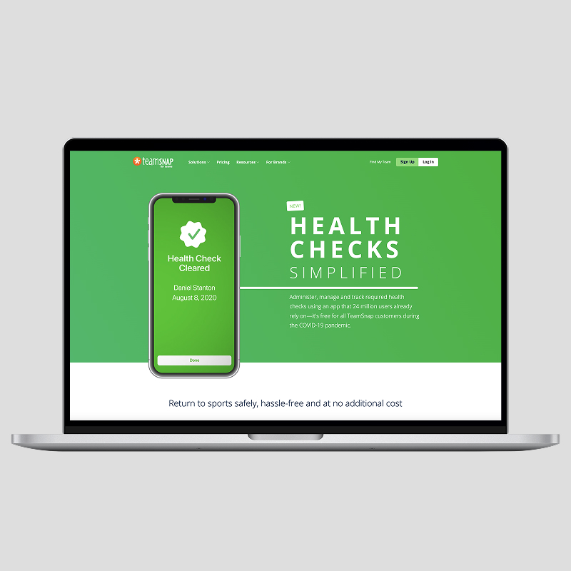
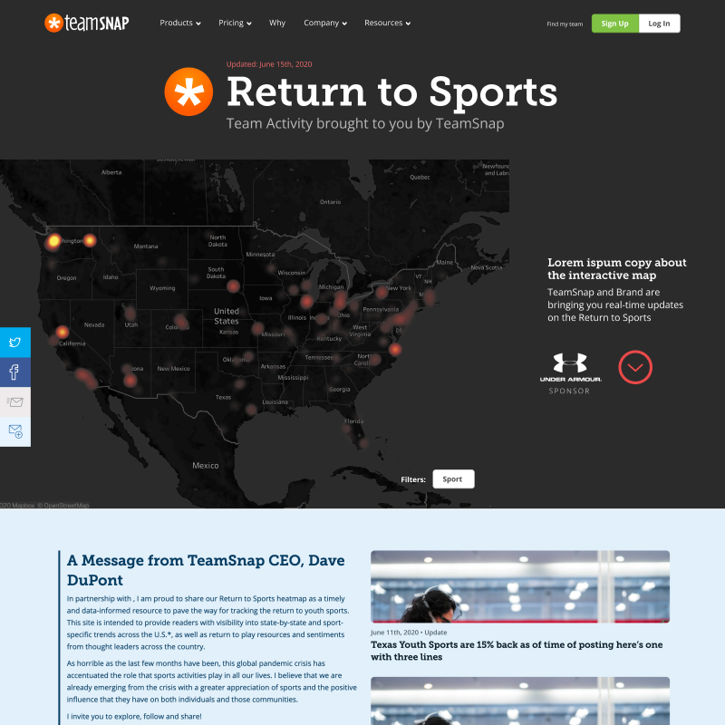
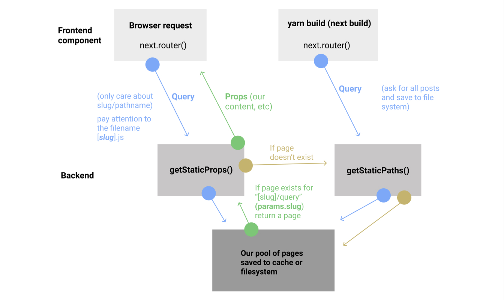
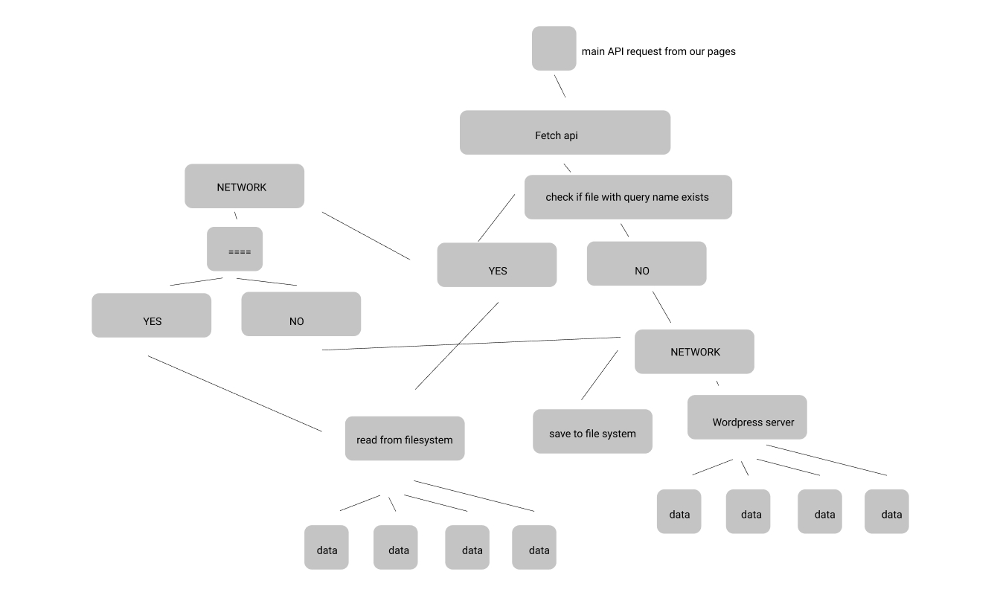
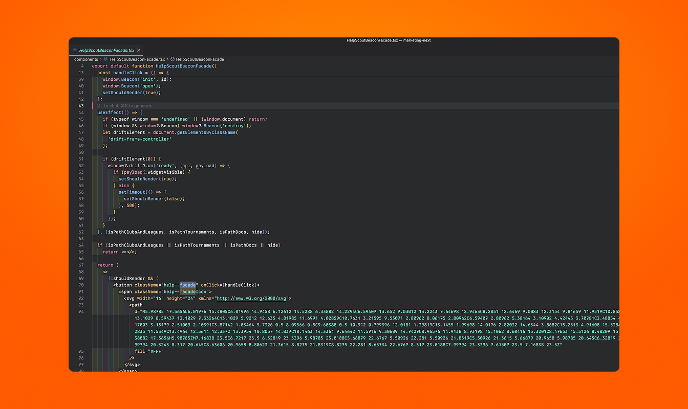
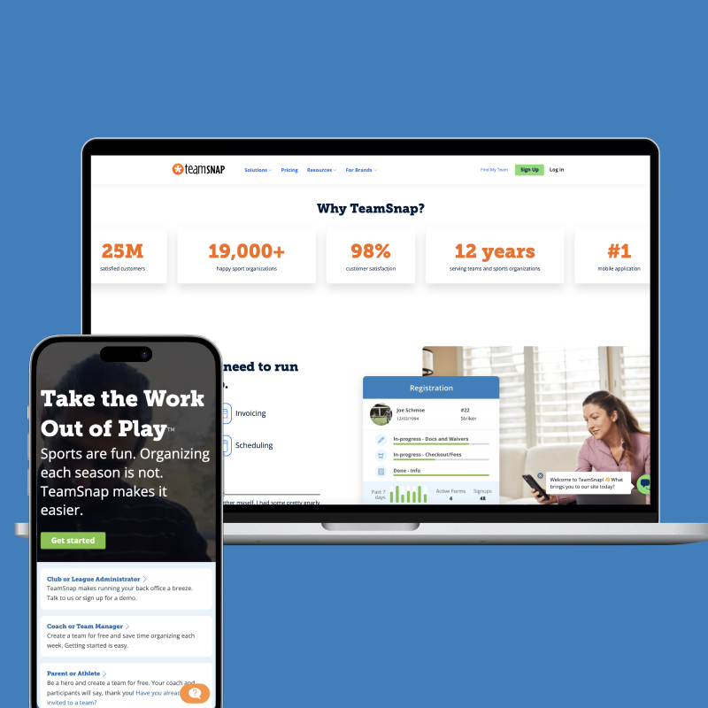
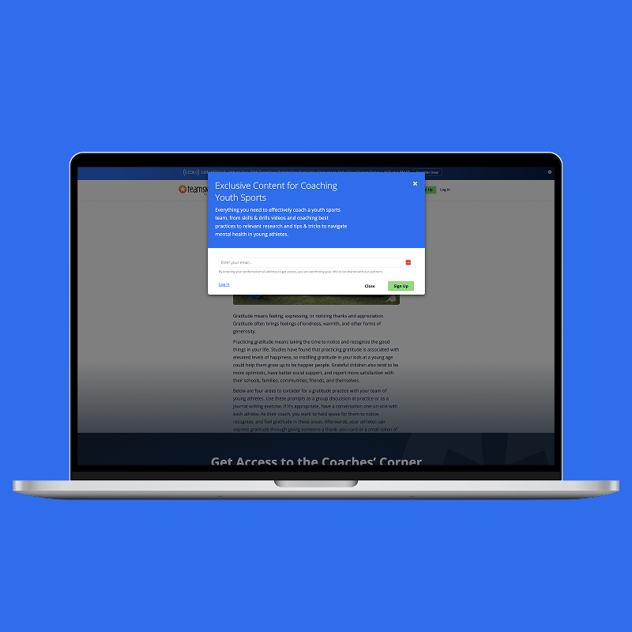
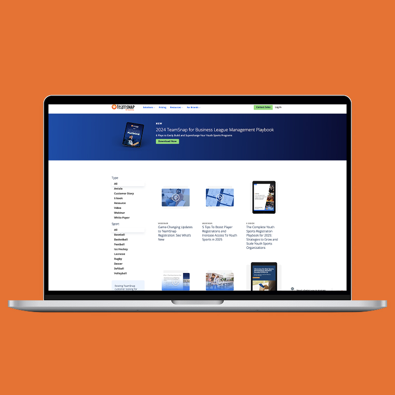
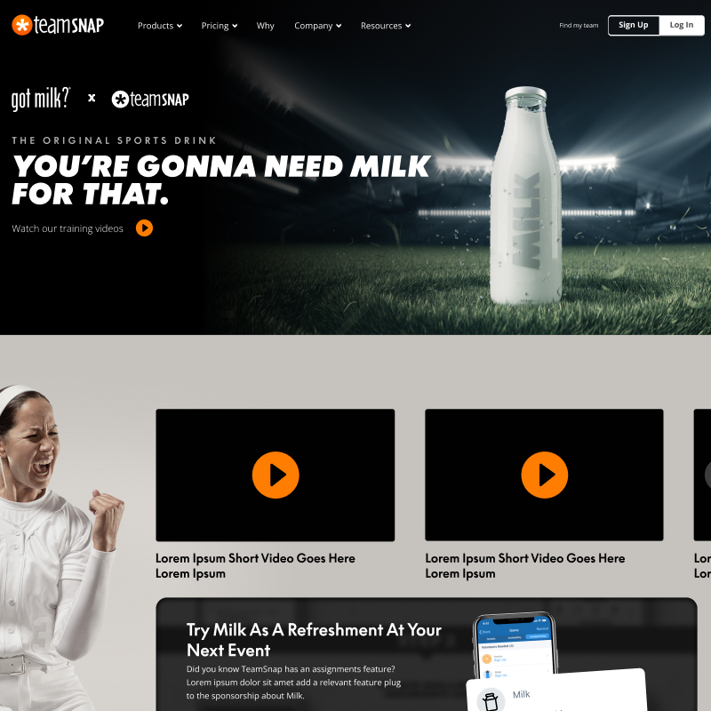

import video from './styleguide.mp4'
import hboMax from './hbo-max.mp4'

<Hero>
   <Container>
        <Block>
            <h1>{props.pageContext.frontmatter.title}</h1>
        </Block>
        <AssetImage>
            
        </AssetImage>
   </Container>
</Hero>

<Container>
    <Block>
        ## Summary
    </Block>
</Container>

<Container className="work-intro">
   <MainColumn>        
        <Block>
            ### Mission

            TeamSnap is a successful Youth Sports ecosystem serving over 25 million users. They are a household name in the industry for managing your team at any level, including at the business level
        </Block>

        <Block>
            ### My Contributions

            I was an employee with TeamSnap for six years and have contracted off and on since leaving. I have contributed to many parts of the business but my main role was managing the main website and was typically a bridge between product design and marketing design. I supported many marketing initiatives, the company had a successful exit to private equity. We grew like crazy while I was a part of the team.
        </Block>
   </MainColumn>
   <Sidebar>
        <Block>
            ### Company

            TeamSnap
        </Block>
        <Block>
            ### Services

            - User Interface Design
            - Web Design
            - Web Development 
            - Custom Analytics Development
            - Sales Team Support
            - Digital Advertising Support
            - A/B Testing Lead
        </Block>
        <Block>
            ### Tools & Tech

            - Figma
            - Next.JS
            - Wordpress (for blog)
            - Sanity CMS
            - Netlify
            - TeamSnap UI
        </Block>
   </Sidebar>
</Container>

<Container>
    <Block>
        ## Impact
        
        Here are some various metrics I drove over the years:

        <Metrics>
            <Metric>
                ### -6
                
                Seconds reduced from site speed from old CMS to new stack
            </Metric>
            <Metric>
                ### 1
                
                Successful exit support
            </Metric>
            <Metric>
                ### +7 million
                
                Users we acquired as a company during my tenure
            </Metric>
            <Metric>
                ### 50k
                
                A month visitors to our Return to Sport initiative during COVID
            </Metric>
            <Metric>
                ### 3
                
                Promotions in six years for strong job performance and metrics
            </Metric>
        </Metrics>
    </Block>
</Container>

<Container>
    <Block>
        

        
        ## Select Initiatives

    </Block>
</Container>

<Container>
    <Block>
        ### Health Check Launch and Return to Sport

        During COVID, with youth sports coming to and end temporarily. The whole company rallied to avoid losing a ton of revenue with a feature to help users return to sport. We built an entire content play to capture traffic and keep TeamSnap top of mind. We also launched a new feature and set of landing pages on the marketing site. We were able to stave off too much of a slump and kept our brand top of mind when looking for COVID and youth sports content
    </Block>
    <Assets className="three-column">
        <AssetImage>
            
            *Health Check Landing Page*
        </AssetImage>
        <AssetImage>
            
            *Return to Sports Heatmap*
        </AssetImage>
        <AssetImage>
            
            *3 Million Health Checks Announcement*
        </AssetImage>
    </Assets>
</Container>

<Container>
    <Block>
        ### CMS Conversion, Rebuild, and Performance Tuning

        When I first joined TeamSnap was when Google started really caring about web performance in their algorithm. Our site took almost 8 seconds to load on a good day, this was all attributed to an obscure and legacy CMS. I went on a 3-month sprint to convert the site over to Next.js, Sanity CMS, and Headless Wordpress and site speed has held steady at under 2 seconds to load. I also innovated ways to load our third-party tools with “facades” to keep load times fast. Content editors are happy, Google is happy and the site is still running at peak performance with 4,000+ pages of ingested content from the various API.
    </Block>
    <Assets>
        <AssetImage>
            
            *CMS Conversion Data Model*
        </AssetImage>
    </Assets>
    <Assets className="two-column">
        <AssetImage>
            
            *Diagaram of the the CMS data structure*
        </AssetImage>
        <AssetImage>
            
            *Facade code that loads a button that triggers loading the library*
        </AssetImage>
    </Assets>
</Container>

<Container>
    <Block>
        ### Pricing and Homepage A/B Tests

        Throughout the years we iterated on our homepage and pricing pages constantly. Some tests successful, some not as the A/B testing game goes. The test that won, have stood the test of time for the brand.
    </Block>
    <Assets className="two-column">
        <AssetImage>
            
            *Mobile A/B Test and below fold desktop*
        </AssetImage>
        <AssetImage>
            
            *Pricing Page A/B Test*
        </AssetImage>
    </Assets>
</Container>

<Container>
    <Block>
        ### Web Styleguide
        
        I created a web styleguide for TeamSnap to share with external partners, it is a living document with some awesome brand moments and kept us consistent across our marketing.
    </Block>
    <Assets>
        <AssetVideo src={video} />
    </Assets>
</Container>

<Container>
    <Block>
        ### Gated Content Systems
        
        For both B2C and B2B, we built a custom gated content system to keep the UX/UI on site, but offer helpful content and resources to both audiences. It is simple account systems integrated into the CRM on the B2B side and a simple Google Sheet for speed on the B2C side.
    </Block>
    <Assets className="two-column">
        <AssetImage>
            
            *Coaches' Corner Sign up Gate and below fold*
        </AssetImage>
        <AssetImage>
            
            *B2B Gated Content System*
        </AssetImage>
    </Assets>
</Container>

<Container>
    <Block>
        ### Advertising LoB Support
        
        As TeamSnap started adding advertising as a Line of Business, I helped scaffold out some of the offerings on the marketing site and delivered on custom landing pages. We also would build very custom web presentations to try win business from potential partners
    </Block>
    <Assets>
        <AssetVideo src={hboMax}>
            *HBO Max Campaign*
        </AssetVideo>
    </Assets>
    <Assets className="two-column">
        <AssetImage>
            
            *Milk Pep Sports Campaign*
        </AssetImage>
        <AssetImage>
            
            *Sponsored Holiday Guide*
        </AssetImage>
    </Assets>
</Container>